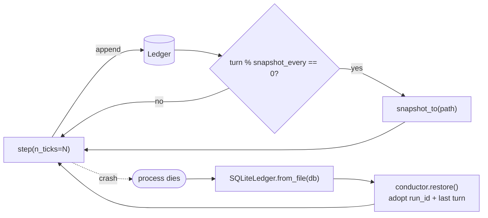

# Long-Running Scenarios

An LLM call is request-response; a scenario that runs for hours is not.  The
engine treats the long-running operation as a durable loop whose **checkpoint is
the ledger**, paced by **two clocks**, bounded by a **token-aware governor**.

## Two clocks

```
Wall clock (real time)            Sim clock (turns)
   "one episode every hour"  ──►  conductor.step(n_ticks=60)
   (a cron / scheduler concern)   (60 sim-ticks at full inference speed)
```

`step(n_ticks=N)` advances N sim-ticks in one call.  Wall-clock cadence is the
caller's job (a cron, a durable-execution timer); the conductor only knows sim
time.  This is what lets the same scenario "run in realtime" for a demo and
"simulate a day in ten minutes" for testing.

## The ledger is the checkpoint



Because all state derives from the append-only ledger, crash recovery is nearly
free:

```python
ledger    = SQLiteLedger.from_file("runs/village.db")   # rehydrate from disk
conductor = Conductor(scenario, ledger=ledger)
conductor.restore()        # adopt run_id + last turn from the tail
conductor.step(n_ticks=60) # continue the same run
```

`restore()` returns False on an empty ledger (start fresh).  `snapshot_every` +
`snapshot_path` periodically checkpoint a SQLite ledger via its native backup.
`scripts/resume_run.py` is the end-to-end demo: run it twice against the same DB
and the turn count climbs.  `tests/test_long_running.py` proves resume + snapshot.

### Durable backend (env-gated)

For a hosted, multi-instance deployment the checkpoint can live in managed
Postgres instead of a local file.  `SqlAlchemyLedger` (ADR-0014) is a drop-in
backend with the same idempotency + ordering guarantees, driving both Postgres
(Neon) and SQLite through one SQLAlchemy code path.  Selection is env-gated:
`make_ledger()` returns `SqlAlchemyLedger(DATABASE_URL)` when `DATABASE_URL` is
set and the in-memory `Ledger` otherwise — so the system runs fully offline by
default and never imports SQLAlchemy unless a backend is configured.  `restore()`
works identically over it.

## The governor as safety valve

A "many small models posting to a shared board" topology is exactly what produces
runaway cascades and surprise bills.  The Governor caps calls (per-turn, total),
tokens (`max_total_tokens`), and spend (`hourly_budget_usd`).  Providers report
`last_usage`; the conductor meters real tokens into the governor each turn.  All
token/spend limits default to off, so opting in is a config choice.

## Hibernation

Agents that aren't scheduled cost nothing — they are rows in the registry with
their memory derived from the ledger.  Only the handful acting this turn consume
inference.  That is how a 20-agent village stays affordable.

## What layers on top (deferred to docs, not built)

- **Wall-clock cadence**: a cron job calling `step(n_ticks=…)` then exporting an
  episode artifact.
- **Durable execution**: Temporal / Modal / Inngest wrap the loop for retries,
  timers, and replay — the ledger holds domain state, the engine holds scheduling.
- **Cost telemetry**: an LLM-observability hook (Langfuse/Helicone/OpenLLMetry)
  feeds real per-call cost into `record_call(cost_usd=…)`.

## Code

- `src/core/conductor.py` — `step(n_ticks)`, `restore()`, `_maybe_snapshot()`
- `src/core/governor.py` — token + spend caps, `reset()`
- `src/core/sqlite_ledger.py` — persistence, `snapshot_to()`, `from_file()`, `tail()`
- `src/core/sqlalchemy_ledger.py` — durable Postgres/SQLite backend (ADR-0014)
- `src/core/ledger_factory.py` — `make_ledger()`, env-gated backend selection
- `scripts/resume_run.py` — resume/long-run demo entrypoint
