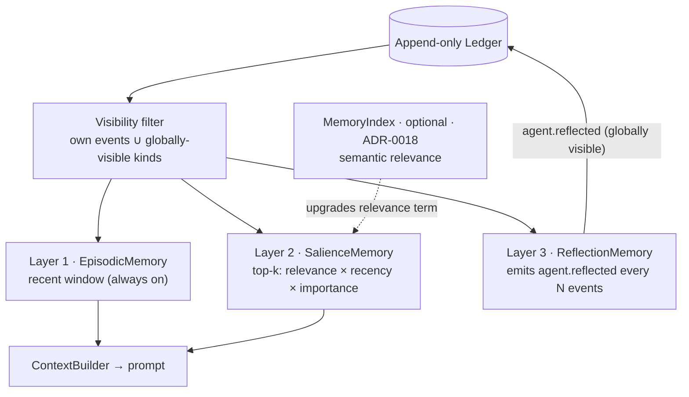

# Memory Architecture

## The Core Insight

Agent memory is not a separate store.
It is a **filtered view over the shared append-only ledger**, computed fresh each turn.

This solves four problems at once:
- **Consistency**: memory is always in sync with the ledger — no sync bugs possible
- **Crash recovery**: reload the ledger, rebuild every memory view from scratch
- **Testability**: memory retrieval is a pure function (events → recalled events) — trivial to test
- **Privacy**: an agent's memory can only see events it was authorised to see

---

## Three Layers



All three layers are *views over the one ledger* — none holds separate state.

### Layer 1: EpisodicMemory (always on)

The simplest layer.  An agent sees:
- Its own events (any kind, any turn)
- Globally-visible event kinds: `world.observed`, `judge.verdict`,
  `user.injected`, `run.started`, `agent.reflected`

The window is capped at `manifest.memory.window` (default 8) for small-model
context budgets.  Returns the most-recent N visible events in chronological order.

```python
class EpisodicMemory:
    agent_name: str
    max_recent: int = 8

    def visible(self, events) -> list[Event]:
        return [e for e in events if mine_or_global(e)][-max_recent:]
```

**When to use**: always.  It is the baseline memory layer and is always enabled.

---

### Layer 2: SalienceMemory (optional, manifest.memory.use_salience=True)

Replaces recency-window ranking with composite salience scoring:

```
salience(e) = w_rel·relevance(e, query) + w_rec·recency(e, turn) + w_imp·importance(e.kind)
```

| Component | How computed | Default weight |
|---|---|---|
| relevance | Semantic similarity when a `MemoryIndex` is attached (ADR-0018); else Jaccard similarity between event text and current scene | 0.30 |
| recency | exp(−λ·Δturn), λ=0.1 → half-life ≈7 turns | 0.40 |
| importance | Kind-based weight table | 0.30 |

**Importance weights** (from `memory.py`):

| Event kind | Weight |
|---|---|
| `user.injected` | 0.95 |
| `verdict.final` | 1.00 |
| `judge.verdict` | 0.90 |
| `agent.reflected` | 0.85 |
| `clue.found` | 0.80 |
| `world.observed` | 0.70 |
| `agent.spoke` | 0.50 |
| `agent.thought` | 0.40 |
| `run.started` | 0.30 |

Top-K events by salience score are returned in chronological order so the
prompt reads naturally (not by importance descending).

**When to use**: enable when agents run for many turns and need to surface
important but older memories over irrelevant recent ones.
First enable point: when the agent window fills up (>30 turns).

**Semantic relevance (ADR-0018, implemented)**: the keyword-Jaccard relevance is
the offline default; attaching a `MemoryIndex` upgrades only that term to
semantic search (see "Semantic Relevance Index" below). Recency, importance, the
visibility filter, and the `format_for_prompt` shape are unchanged.

---

### Layer 3: ReflectionMemory (optional, manifest.memory.reflection_threshold=N)

Triggered when an agent has seen `N` visible events since the last reflection.
The agent is instructed to emit an `agent.reflected` event whose payload is a
high-level belief synthesising recent experience:

```
agent.reflected → {"belief": "the baker resents me", "based_on": ["evt-123", "evt-456"]}
```

Reflection events are globally visible — every agent sees them, including the
reflector itself.  This means beliefs accumulate over time without the cost
of carrying raw episodic history, and the judge can read an agent's current
belief state without full access to its memory.

**Compaction effect**: each reflection replaces N raw events with 1 belief.
After K reflections, the effective context window is `K·1 + recent_window`
instead of `N·K + recent_window`.  This is how you keep a villager coherent
over 200 turns with an 8-event context window.

**When to implement**: Phase 2 milestone.  The `ReflectionTracker` class is
already present in `src/core/memory.py` — it just needs the agent to check
`tracker.observe(events)` each turn and emit the reflection when due.

---

## Semantic Relevance Index (ADR-0018, optional)

The `relevance` term in Layer 2 can be computed by **semantic search** instead of
keyword overlap. This is a *derived, rebuildable lens over the ledger* — it
changes how relevance is scored, never which events are eligible (the visibility
filter and the recency/importance terms are untouched). The ledger stays the
single source of truth (ADR-0005): the index is keyed by `event.id` (re-indexing
is idempotent) and can be wiped and rebuilt from the ledger.

```python
@runtime_checkable
class MemoryIndex(Protocol):
    def index(self, events: tuple[Event, ...]) -> None: ...   # derive, idempotent by id
    def search(self, query: str, k: int) -> list[Event]: ...  # read back by relevance
```

`SalienceMemory(..., index=...)` derives, then reads: it indexes the visible
candidates first, then queries, so a hit can never be an event the ledger has not
produced. With `index=None` (the offline default) the relevance term is keyword
Jaccard, byte-for-byte unchanged.

**Backend (`Mem0MemoryIndex`)**: stores each event as one raw memory with
inference disabled (the text is embedded verbatim — no model-driven fact
extraction), carrying the full event in metadata so a hit reconstructs the
`Event`. Lazy-imported, so `import src.*` / `import app` work with the package not
installed.

**Gate**: `memory_index_from_env()` returns `None` unless `MEMORY_INDEX` is
truthy. When active, embeddings run **locally** via sentence-transformers
(`all-MiniLM-L6-v2`) by default — no API key, fully offline once the model is
cached — or are repointed (e.g. to a different embedder, or the project's
Postgres+pgvector, ADR-0014) via `MEMORY_INDEX_CONFIG` (a JSON blob forwarded
verbatim to the backend's `from_config`). Install the `memory` extra (`mem0ai` +
`sentence-transformers`). See ADR-0019.

**Hosted backend (opt-in, ADR-0020)**: set `MEMORY_INDEX=cloud` (or
`MEMORY_INDEX_BACKEND=cloud`) to use mem0's managed platform (`MemoryClient`,
api.mem0.ai) instead of the local embedder. `Mem0CloudIndex` satisfies the *same*
`MemoryIndex` protocol — derived, idempotent by `event.id`, ledger-is-truth,
verbatim `infer=False` storage — so nothing downstream changes; only *where* the
embedding and retrieval run differs. It needs `MEM0_API_KEY` (plus optional
`MEM0_ORG_ID` / `MEM0_PROJECT_ID` / `MEM0_HOST`). **Caveat:** activating it sends
ledger event text to mem0's servers — a deliberate departure from the
off-the-grid default, which is why the local backend remains the default.

**Alternative backends**: the two-method protocol can wrap any retrieval store —
a stateful agent-memory service (e.g. a Letta-style memory server) could be a
`MemoryIndex` too, as long as it stays derived from and rebuildable from the
ledger.

---

## Context Builder Layering

The ContextBuilder assembles layers in this order (permanent cost → variable cost):

```
IDENTITY          ← persona (never compresses)
CURRENT SCENE     ← world state from the projection
YOUR MEMORY       ← EpisodicMemory or SalienceMemory output
VISITOR           ← recent user_artifacts (last 3)
[EXTRA]           ← scenario-specific, from _build_extra_prompt()
[OUTPUT FORMAT]   ← JSON constraint (added by structured.py)
```

The layering order is deliberate:
- The model must read IDENTITY first to stay in character
- Scene before memory — what's happening now is more important than what happened before
- Visitor disturbances are always included because they are the most salient inputs
- JSON instruction is last so the model focuses on generating before being constrained

---

## Phase 3 Upgrade Path

| Feature | Phase | Mechanism |
|---|---|---|
| Keyword salience | 2 | `SalienceMemory` with Jaccard relevance |
| Reflection events | 2 | `ReflectionTracker` + `agent.reflected` kind |
| Embedding relevance | done | `MemoryIndex` semantic search for the relevance term (ADR-0018) |
| pgvector retrieval | done | `MEMORY_INDEX_CONFIG` persists vectors in the ADR-0014 Postgres/pgvector store |
| Belief graph | 4 | Structured belief store derived from reflection events |
