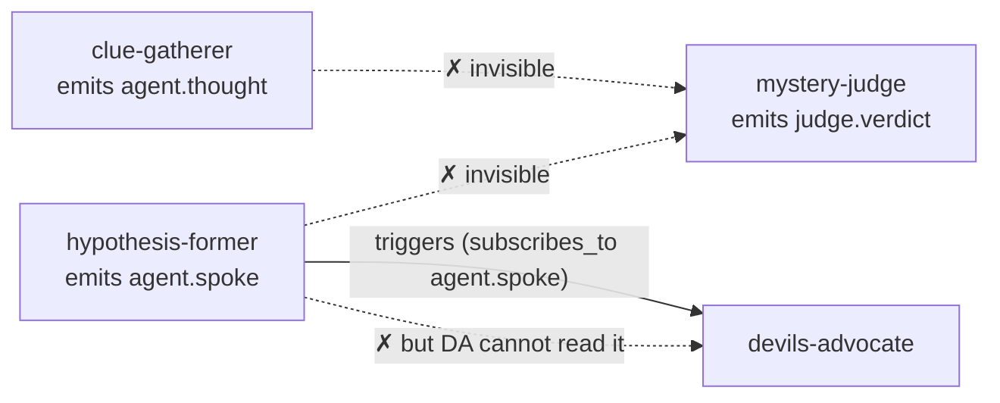

# Architecture Review & Next Steps

*A senior-architect pass over the engine as it stands at commit `bac2c62`. Read
this as a map of where the design is load-bearing, where it is theatrical, and
what to do next — ordered by impact, not by phase.*

This document is opinionated on purpose. The codebase is genuinely well-built; the
findings below are the things worth fixing precisely *because* the foundation is
strong enough to deserve them. Line references are to the tree at review time.

---

## 1. Verdict in one paragraph

The event-sourced core is real and clean: an append-only ledger, pure-function
projections, a four-contracts framing (`events` / `ledger` / `manifest` / tool
registry) that actually holds, and a config-over-code surface that is validated and
tested (`tests/test_modularity.py` is not a slogan — it runs). The optional-dependency
discipline is excellent: the whole thing runs offline on a deterministic stub with
no API key, and every live capability (LiteLLM, Instructor, MCP, mem0, Postgres) is
lazily imported behind a gate. **The one structural gap that undercuts the headline
thesis — "tiny specialists argue, remember, and judge through a shared ledger" — is
that agents mostly cannot see each other's work.** Fix that first; most of the rest
is hardening and reach.

---

## 2. What is genuinely strong (keep it)

- **Event sourcing done properly.** `Ledger.append` is idempotent by `id`
  (`src/core/ledger.py:19`); projections are pure functions of the log
  (`src/core/projections.py`); memory *is* a ledger view, not a second store. This is
  the right spine and it is uncompromised.
- **The four contracts are real.** Open, format-validated event kinds
  (`src/core/events.py:33`) mean a new scenario mints `clue.found` without an engine
  edit; the manifest is the only thing the conductor knows about an agent
  (`src/core/manifest.py`); the tool registry checks capability *before* transport, so
  MCP is transport and not the security boundary (`src/tools/registry.py:88`).
- **Per-agent model routing by logical profile** (`tiny/fast/balanced/strong`) is the
  correct abstraction for "a model per job," and the offline stub makes it free to
  demo (`src/models/router.py`).
- **Test discipline.** ~260 deterministic tests, effectively zero behavioural mocks
  (only narrow `sys.modules` fakes for the litellm/instructor transports). The
  modularity invariant and the structured-output paths are both exercised.
- **Documentation density** is far above hackathon norm: ADRs, architecture pages,
  per-phase plans. That is a competitive advantage for the "Best Agent / Architecture"
  judging axes — lean into it.

---

## 3. The findings, ordered by impact

Each finding is tagged **P0–P3** (do-first → nice-to-have), with the evidence and the
smallest fix that resolves it.

### P0 — The shared blackboard is not actually shared

**This is the most important finding in the review.** An agent's memory is
`actor == self OR kind ∈ _GLOBALLY_VISIBLE`, where `_GLOBALLY_VISIBLE` is a hardcoded
set of five kinds (`src/core/memory.py:56`). Crucially, `subscribes_to` controls only
*triggering* in the conductor (`src/core/conductor.py:190`) — **it does not grant the
triggered agent visibility of the event that woke it.** So an agent can be woken by an
event it is structurally forbidden to read.

Trace **Mystery Roots** (the "convergent blackboard swarm"):

| Agent | emits | peer can see it? |
|---|---|---|
| `clue-gatherer` | `agent.thought` | ❌ not globally visible |
| `hypothesis-former` | `agent.spoke` | ❌ not globally visible |
| `devils-advocate` | `agent.thought` (subscribes to `agent.spoke`) | ❌ — and it can't even see the hypothesis it's meant to rebut |
| `mystery-judge` | `judge.verdict` | — but it sees **none** of the clues or hypotheses |



The judge reaches a verdict having seen only the genesis `world.observed` (the seed),
its own prior verdicts, and visitor injections. The clue-gathering and
hypothesis-forming machinery produces events **no one downstream reads.** The
deterministic stub hides this (its output is a hash of the prompt, which still
contains `current_scene` + the agent's *own* memory), so the demo looks plausible —
but on the live path the convergence is hollow.

Why **Thousand Token Wood** *looks* fine by contrast: its lead `scene-whisperer`
emits `world.observed` (globally visible, and it updates `current_scene`), and
`mischief-critic` emits `judge.verdict` (also globally visible). The cast genuinely
shares the evolving scene — but `pocket-actor` (`agent.spoke`) and `echo`
(`agent.thought`) are still siloed; they're rendered to the UI but invisible to peers.
The wood survives because its *primary* signal happens to ride a globally-visible
kind. That's luck, not design.

**Fix (small, high-leverage).** Make visibility declarative instead of a global
constant:

1. Visibility = `own events ∪ globally-visible ∪ subscribes_to`. Pass the manifest's
   `subscribes_to` into `EpisodicMemory` / `SalienceMemory` and union it into the
   filter at `memory.py:76,153,236`. An agent woken by a kind now reads that kind.
2. Add an optional scenario-level `shared_kinds: [...]` (or per-agent `reads: [...]`)
   so a scenario can publish its working kinds to the whole cast without touching
   engine code — closing the "custom visibility needs an engine edit" hole that today
   quietly violates the zero-edit modularity claim.

This is roughly a half-day change and it is the difference between a multi-agent
*theater set* and a multi-agent *system*. Do it before any live demo.

### P0 — The working board never reaches the prompt

Related but distinct: `ContextBuilder.build` assembles the prompt from `persona`,
`goal`, `current_scene`, the agent's `memory_text`, and `user_artifacts`
(`src/core/context.py:58`). It never includes `agent_notes` / `judge_notes` — the very
fields where peer `agent.spoke` / `agent.thought` / `judge.verdict` content
accumulates in the projection (`src/core/projections.py:27-32`). So even the events
that *are* on stage don't feed back into cognition. Once P0-visibility lands, route a
compact "what your peers just did" block into the prompt (it can be derived from the
same visible set, so it stays consistent with memory). Half a day, and it makes
disturbances visibly ripple.

### P1 — Tool calls are invisible to the ledger

The `FortuneTeller` calls the oracle and folds the omen into its event payload
(`src/agents/handlers.py:29`), but **the tool invocation itself is not an event.** For
a system whose entire pitch is "every view is a projection of the log," this is a hole:
a tool call's latency, cost, arguments, and failures are unobservable and unrecoverable
on `restore()`. It gets worse the moment real MCP tools (image-gen, web-fetch) land in
Phase 6, where calls are slow, billable, and fail. Mint `tool.called` / `tool.returned`
(or `tool.failed`) events and append them around every `ToolRegistry.call`. The kinds
are open; this is additive. ~1 day, and it makes the tool path first-class and
debuggable.

### P1 — No causal links between events

Events are a flat sequence with no `caused_by` / `parent_id`
(`src/core/events.py:45`). You cannot reconstruct *why* an event happened from the
ledger — which undercuts both the "visible agent trace is the charm" product thesis and
any future cognition-graph view. Add an optional `caused_by: str | None` field
(additive, backward-compatible) and have the conductor stamp it with the triggering
event's `id` when it drains the subscription queue (`conductor.py:147`). This unlocks a
genuinely impressive UI (a turn-by-turn causality tree) for ~1 day of work.

### P1 — A whole tested subsystem is dormant in the app

`Observer` + `ViewDiff` are designed for incremental, streamable rendering and carry 13
tests (`src/core/observer.py`) — but `app.py` constructs no observer and re-renders the
full state every turn via `c.projection` (`app.py:125-131`). The elegant delta-streaming
path is built, tested, and unused. Wire it in to get (a) cheaper renders, (b) an
auto-advance "play" loop, and (c) a foundation for SSE/WebSocket streaming. ~1 day.

### P2 — "Hourly" budget has no clock

`Governor.hourly_budget_usd` is compared against cumulative `_spend_usd`, which only
zeroes on `reset()` (`src/core/governor.py:45`). There is no time import anywhere in the
governor — **it is a per-run total cap wearing an "hourly" label.** For the
flagship "build for hours" story this is a truth-in-advertising bug. Either implement a
real sliding wall-clock window (stamp spend with timestamps, expire > 1h) or rename it
`total_budget_usd` and add `hourly_budget_usd` properly. Also note the cap is checked
*before* a call but tokens are recorded *after* (`conductor.py:156-166`), so a single
large call can overshoot by one call's worth — acceptable, but document it.

### P2 — Projection rebuild is O(n) per tick → O(n²) per run

`Conductor.projection` calls `rebuild_stage(self.ledger.events)` over the *entire* log
on every access (`conductor.py:72`), and `_outputs` in `app.py` reads it on every
render. Within a tick the projection is then updated incrementally — so the full
rebuild is pure waste. For the headline 2000-turn runs this is quadratic. Cache the
projection and apply events incrementally (the machinery already exists — `apply()` is
called per event at `conductor.py:168`); invalidate on `reset`/`restore`. Half a day,
and it removes the main scaling cliff.

### P2 — Scenarios cannot end or converge-and-stop

The loop runs until a governor cap throws (`conductor.py:142`). A scenario cannot
declare a terminal condition ("the mystery is solved," "the episode is published"), so
Mystery Roots emits a verdict every 4 ticks *forever* and nothing resolves. This caps
the "story" feel and blocks the serial/episodic shapes. Add an optional, declarative
stop predicate (e.g. a scenario-level `ends_when: { kind: verdict.final }` or a
`terminal_kinds` list the conductor watches) that pauses the run and emits `run.ended`.
~1–2 days; it turns "a loop" into "a story."

### P2 — Dead config field: `max_consecutive`

`ScheduleConfig.max_consecutive` is declared and documented as an anti-starvation guard
(`src/core/manifest.py:50`) and asserted in a test — but **nothing reads it.** The
conductor's scheduler only consults `tick_every` (`conductor.py:205-208`). Either
implement the guard (track per-agent consecutive acts; skip when exceeded) or delete the
field. Dead knobs erode trust in the config surface. Half a day.

### P3 — Demo robustness: process-global state across sessions

`app.py` builds `_conductors` once at import as module globals (`app.py:34`). Gradio is
multi-user; two viewers of a deployed demo share one ledger and stomp each other's runs
(Start resets shared state). For Community-Choice shareability this will bite during
judging. Key conductors by Gradio session (`gr.State` or a session→conductor map). Half
a day, and it makes a public link safe to share.

### P3 — Turns are serial; "many small models" wants concurrency

`_run_agent` calls `provider.complete()` synchronously, one agent at a time
(`conductor.py:157`). On the live path a turn of N agents costs N × network latency in
series, and the Gradio handler blocks until all finish. The "many small models posting
to a board" economic argument *wants* the independent agents in a tick to run
concurrently. Make `act()` awaitable and fan out the non-dependent agents in a tick with
`asyncio.gather` (the subscription cascade stays ordered; only same-phase independent
agents parallelize). This is the largest single latency win for live demos. ~2–3 days.

### P3 — Model errors become in-world content

On a live failure `LiteLLMProvider.complete` returns `f"[model error: {exc}]"`
(`src/models/litellm_provider.py:81`), which is then parsed as agent output and lands on
the ledger and the stage as a "line." A transport hiccup becomes dialogue. Emit a
`system.error` event (not rendered on stage, visible in the ledger) or skip the turn.
Half a day; it keeps the stage clean when the network isn't.

---

## 4. Priority summary

| # | Finding | Tag | Effort | Why it matters |
|---|---|---|---|---|
| 1 | Cross-agent visibility (subscribes_to ≠ reads) | **P0** | ½d | Makes the shared blackboard real |
| 2 | Working board never reaches the prompt | **P0** | ½d | Disturbances actually ripple |
| 3 | Tool calls as events | P1 | 1d | Ledger becomes the whole truth |
| 4 | Causal links (`caused_by`) | P1 | 1d | Enables the cognition-graph view |
| 5 | Wire Observer/ViewDiff into the app | P1 | 1d | Streaming + auto-play, already tested |
| 6 | Governor real time window | P2 | ½d | "Hourly" budget that is hourly |
| 7 | Memoize the projection | P2 | ½d | Removes the O(n²) long-run cliff |
| 8 | Scenario terminal conditions | P2 | 1–2d | Turns a loop into a story |
| 9 | Implement or delete `max_consecutive` | P2 | ½d | No dead knobs |
| 10 | Per-session conductor state | P3 | ½d | Safe to share the demo link |
| 11 | Concurrent agent turns (async) | P3 | 2–3d | Biggest live-latency win |
| 12 | Model errors ≠ stage content | P3 | ½d | Clean stage when the net hiccups |

**The single highest-leverage hour:** finding #1. It is small, it is tested-against by
`test_salience_memory.py` / `test_memory.py` (so you'll know immediately if you break
visibility semantics), and it converts the central claim of the project from aspiration
to fact.

---

## 5. The best possible demo

The thesis to land in 90 seconds: *AI is load-bearing, many small specialists do
different cognitive jobs, the append-only ledger makes the whole thing observable, and
the visitor can disturb the world and watch the consequences propagate.*

### Recommended track (do finding #1 + #2 first)

Hero scenario: **Mystery Roots, live, on the small Modal models.** Once visibility is
real, a convergent mystery is the strongest possible demonstration of "load-bearing
multi-agent on small models," because the audience watches a *chain of reasoning* build:

```
Beat 0  Open on 🍄 Thousand Token Wood (deterministic stub) for the charm.
        One line: "same engine, three YAML configs." Switch the dropdown live → Mystery Roots.
Beat 1  Start with the frozen seed:
        "All the clocks in the wood stopped at 3:07. No one wound them down."
        Advance 3–4 turns. Narrate the roles as they fire: Clue Gatherer → Hypothesis
        Former → Devil's Advocate → Judge. Point at the ledger growing on the right.
Beat 2  THE DISTURBANCE (the wow moment). Inject a planted clue:
        "A child insists she saw the clockmaker leave at 3:06, carrying a sixth clock."
        Advance. Watch the next hypothesis + verdict bend to incorporate it.
Beat 3  Point to Run Stats: tokens, spend ($, real via LiteLLM), _raw_fallback rate,
        per-profile model map. "Every model here is ≤32B; the worker is ≤4B."
Beat 4  Open the Configuration accordion: "all of this — cast, models, budgets — is
        YAML, not code. A fourth world is a file."
```

The disturbance bending the verdict is the entire pitch in one gesture — and it only
*actually works* after finding #1.

### Safe fallback track (no fix, no network)

If live infra is shaky on the day, demo **Thousand Token Wood on the deterministic
stub**: fully reproducible, zero latency, no key, and its `world.observed` propagation
already works. Seed: `A village of stage props wakes up and argues about which fairy
tale they belong to.` Inject: `A lantern starts whispering recipes for impossible soup.`
You lose the "convergent reasoning" story but keep delight + observability + modularity,
and nothing can fail on stage.

### Pre-flight checklist

- [ ] Land findings **#1, #2** (real collaboration) and **#10** (per-session state).
- [ ] **Freeze the seed** and do a recorded run as the ultimate fallback (the rubric
      asks for this anyway — `docs/strategy/codex-judge-rubric.md`).
- [ ] **Pre-warm the Modal endpoints** before the demo (cold starts will kill the pace).
- [ ] Confirm `_raw_fallback` < 10% on the live models (it's already on the stats panel).
- [ ] Fix **#12** so a transient model error can't print to the stage mid-demo.
- [ ] Have the stub demo wired to a one-key toggle as the in-room safety net.

Update `docs/runbooks/demo.md` to make Mystery Roots the hero once #1 lands; today it
documents the Wood opener only.

---

## 6. How to add a new scenario

The full, worked recipe lives in **[../scenario-authoring.md](../scenario-authoring.md)** —
it walks one complete scenario from empty directory to running app, names exactly which
of the four contracts each step touches, and calls out the visibility gotcha above so
your cast actually collaborates. Start there.

---

## 7. Roadmap delta

The existing `roadmap.md` / `next-steps/phase-*.md` plans are sound; this review does
not replace them, it reprioritizes. The phase docs optimize for *reach* (new scenarios,
durable execution, MCP servers). This review argues that **two half-day correctness
fixes (#1, #2) and three observability fixes (#3, #4, #5) should land before any new
reach**, because they make the features you already shipped actually deliver on their
promise — and because they make the demo true rather than merely impressive.

Suggested sequencing:

1. **Correctness sprint (1–2 days):** #1, #2, #9, #12. The blackboard becomes real and
   the stage stays clean.
2. **Observability sprint (2–3 days):** #3, #4, #5. Tool calls and causality become
   first-class; the app streams.
3. **Then resume reach:** Phase 6 (Illustrated Serial) — which now *depends* on #3
   (tool events) and #8 (terminal conditions) being in place, a dependency the current
   phase-6 doc does not state.
4. **Scale honesty in parallel:** #6, #7 whenever a long run is on the calendar.
