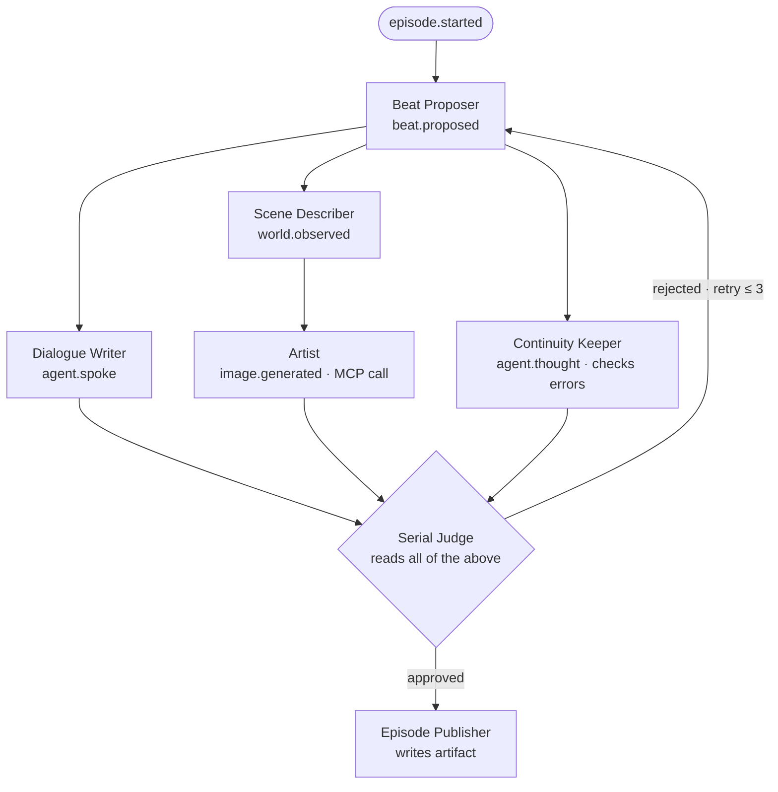

# Phase 6: Illustrated Serial — The Third Scenario

## Goal

Prove the engine by building a structurally different third scenario: the Illustrated
Serial.  Where Thousand Token Wood is divergent world-growth and Mystery Roots is
convergent solving, the Serial is a **wall-clock cadenced creative loop** that produces
a publishable artifact (a comic page or interactive story episode) every hour.

This is the scenario that requires image generation, an Artist agent, and the MCP tool
integration from Phase 4.  It is also the scenario that most closely resembles a
real product: a serialised AI comic that updates itself.

**Acceptance criteria**:
- A new episode is published every hour without human intervention.
- Each episode contains: a prose scene, a generated image, character dialogue, and
  the current story arc status.
- Adding the Serial required zero engine edits (modularity invariant holds for 3 scenarios).
- The Continuity Keeper catches and corrects at least one continuity error per 10 episodes.

---

## Agent cast

| Agent | Role | May emit | Subscribes to |
|---|---|---|---|
| Beat Proposer | worker | `beat.proposed` | `run.started`, `episode.started`, `judge.approved` |
| Dialogue Writer | worker | `agent.spoke` | `beat.proposed` |
| Scene Describer | worker | `world.observed` | `beat.proposed` |
| Artist | worker | `image.generated` | `world.observed` |
| Continuity Keeper | worker | `agent.thought` | `world.observed`, `beat.proposed` |
| Serial Judge | judge | `judge.verdict`, `judge.approved`, `judge.rejected` | `image.generated`, `agent.spoke` |
| Episode Publisher | observer | (none — writes to disk) | `judge.approved` |

The Writer is intentionally split into three sub-specialists (Beat Proposer, Dialogue
Writer, Scene Describer) — each does one narrow thing well, keeping prompts tiny and
small-model-friendly.  This is the "many small over one large" economic argument in action.

### New event kinds required

```python
EventKind = Literal[
    ...,                    # all existing kinds
    "beat.proposed",        # a story beat (what happens next)
    "image.generated",      # result of image-gen tool call
    "episode.started",      # conductor triggers a new episode
    "episode.published",    # the episode artifact is finalised
]
```

---

## The episode loop



The judge holds the **publish gate**: no episode is published unless the judge approves.
On rejection, the judge emits a specific critique as a `judge.verdict` event —
the Beat Proposer subscribes to this and uses the critique to revise the beat.
This is the draft→critique→revise loop described in the original idea draft.

---

## New scenario file: src/scenarios/illustrated_serial.py

```python
class IllustratedSerial(Scenario):
    def genesis(self, run_id, turn, seed) -> Iterable[Event]:
        yield Event(kind="run.started", payload={"seed": seed, "arc": seed})
        yield Event(kind="episode.started", payload={"episode": 1, "arc_so_far": ""})
    
    def schedule(self, turn: int) -> tuple[Agent, ...]:
        # The Serial is subscription-driven; tick scheduling is minimal.
        # The Episode Publisher fires on judge.approved events, not on ticks.
        return ()  # all routing is subscription-based via manifests
```

### Manifest: Artist

```yaml
name: artist
role: worker
persona: >
  You are the Artist — you translate prose scene descriptions into vivid image
  prompts and call the image-gen tool to produce the image. One image per scene.
  Your prompts are specific: lighting, mood, palette, composition.
subscribes_to:
  - world.observed
may_emit:
  - image.generated
model_profile: fast
tools:
  - image-gen   # MCP server from Phase 4
```

### Manifest: Continuity Keeper

```yaml
name: continuity-keeper
role: worker
persona: >
  You are the Continuity Keeper — you read the current beat and compare it against
  the story so far. If you see a contradiction (wrong character name, impossible
  timeline, repeated scene), flag it. Otherwise, confirm continuity is maintained.
  One sentence. Start with "CONTINUITY OK" or "CONTINUITY ERROR: <what's wrong>".
subscribes_to:
  - beat.proposed
  - world.observed
may_emit:
  - agent.thought
model_profile: balanced
memory:
  window: 12
  use_salience: true
  reflection_threshold: 10
```

---

## Episode Publisher

The Episode Publisher is an observer (not a worker) — it reacts to `judge.approved`
by writing the episode artifact to disk.  It never emits events.

```python
class EpisodePublisher(Agent):
    name = "episode-publisher"
    manifest = AgentManifest(
        name="episode-publisher",
        role="observer",
        persona="",
        subscribes_to=["judge.approved"],
        may_emit=[],   # observers emit nothing
    )

    def act(self, run_id, turn, projection, recent_events) -> Event:
        episode = build_episode(recent_events)
        write_episode(episode, f"episodes/episode-{episode.number:04d}.md")
        # Return a no-op event so the protocol is satisfied
        return Event(kind="agent.thought", actor=self.name,
                     payload={"text": f"Episode {episode.number} published."})
```

---

## Gradio UI for the Serial

The Serial's Gradio view is different from the Wood's and Roots's.
It needs:
- An episode gallery (one card per published episode)
- The current draft (the most recent scene + image in progress)
- The judge's last verdict
- The arc status (where are we in the story?)

```python
# In app.py, add the serial scenario:
SCENARIOS["📖 Illustrated Serial"] = illustrated_serial.build_scenario()
# The render module needs a serial-specific render_serial_stage() function
```

---

## Image rendering in Gradio

```python
# In render.py
import base64

def render_image(event: Event) -> str:
    """Render an image.generated event as a Markdown image tag."""
    url = event.payload.get("url", "")
    alt = event.payload.get("alt", "Generated scene")
    if url.startswith("data:"):
        return f""
    return f""

# In Gradio: use gr.Image component instead of gr.Markdown for image events
```

---

## Files to add

| File | Purpose |
|---|---|
| `src/scenarios/illustrated_serial.py` | Third scenario — zero engine edits |
| `src/agents/serial/beat_proposer.py` | Beat Proposer agent |
| `src/agents/serial/dialogue_writer.py` | Dialogue Writer agent |
| `src/agents/serial/scene_describer.py` | Scene Describer agent |
| `src/agents/serial/continuity_keeper.py` | Continuity Keeper agent |
| `src/agents/serial/serial_judge.py` | Serial Judge |
| `src/agents/serial/episode_publisher.py` | Episode Publisher |
| `tools/image-gen/server.py` | Image-gen MCP server (from Phase 4) |
| `src/ui/render_serial.py` | Serial-specific Gradio render helpers |
| `tests/test_illustrated_serial.py` | Serial scenario tests |

---

## Estimated effort: 4–6 days
