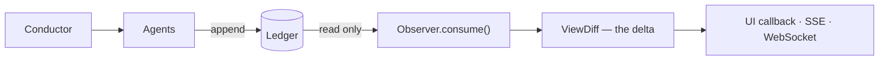

# Observer Pattern — Decoupled Rendering

## Design contract

The observer is the camera crew.  It has exactly one rule: **never append events**.



The cognitive loop (left) writes; the observer (right) only reads. The world runs
identically whether or not any observer is attached.

The cognitive loop runs identically whether or not any observer is attached.
The world is not "observed into existence" — it runs, and the observer watches.

---

## What this buys you

### 1. Multiple renderers off one ledger

```python
stage_observer   = Observer()   # renders the Gradio stage markdown
graph_observer   = Observer()   # renders the cognition graph
chatlog_observer = Observer()   # renders a plain chat log

# All three subscribe to the same ledger; all three update independently
conductor = Conductor(scenario, observer=stage_observer)
```

### 2. Record and replay

Because the ledger is the only source of truth:
```python
# Record a run by keeping the SQLiteLedger file.
# Replay by feeding saved events to a fresh observer:
for event in saved_ledger.events:
    replay_observer.consume(event)
```

The UI can replay any past run, pause it, or fast-forward to a specific turn.

### 3. Testable rendering

The stage is a pure function of the ledger:
```python
# Projections (and therefore observer views) are deterministically testable
events = (world_observed_event, judge_verdict_event)
obs = Observer()
for e in events:
    obs.consume(e)
assert obs.view.judge_notes == ["keep it"]
```

---

## ViewDiff — streaming the delta

Instead of re-rendering the full state each turn, the observer computes a diff:

```python
@dataclass
class ViewDiff:
    scene_changed: bool
    new_scene: str
    new_agent_notes: list[str]
    new_judge_notes: list[str]
    new_user_artifacts: list[str]

    @property
    def has_changes(self) -> bool: ...
```

Only the diff is sent to the client — the right shape for SSE/WebSocket streaming.

---

## Gradio integration (current)

Currently the Gradio UI re-renders by calling `conductor.projection` after each step.
This works but does a full rebuild from the ledger on every render.

The upgrade path (Phase 3):
1. Attach an observer to the conductor at startup.
2. Use `gr.State` + `gr.update()` from the observer callbacks.
3. For real-time streaming, wire a generator-based Gradio output to the observer callback queue.

```python
# Future pattern (Phase 3)
obs = Observer()
conductor = Conductor(scenario, observer=obs)

def stream_step():
    conductor.step()
    # obs.consume() was called inside conductor._append()
    # retrieve the latest diff from obs
    diff = obs.latest_diff()
    if diff.scene_changed:
        yield gr.update(value=render_stage(obs.view))
```

---

## Callback safety

Callbacks are synchronous and called inline during `consume()`.
They must not:
- Append events to the ledger (breaks the read/write separation)
- Block for more than a few milliseconds (blocks the conductor loop)
- Raise exceptions unchecked (propagates into the conductor)

The `Observer` class does not catch callback exceptions — the caller is responsible
for wrapping callbacks in try/except if they can fail.
