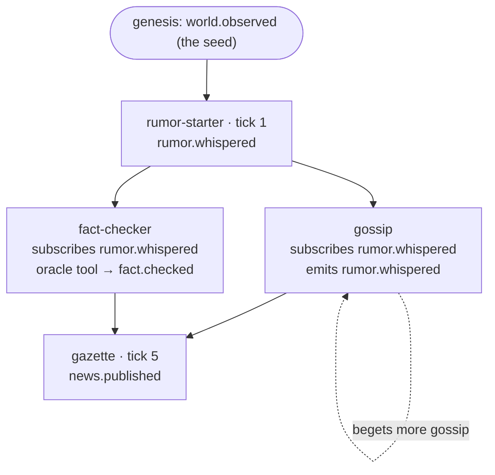

# Adding a Scenario on Top of the Core

A scenario is **data, not code**. The engine — ledger, conductor, projections,
routing, memory, tools — never learns the name of your world. You add a world by
dropping YAML into `config/`, and only write Python for the one thing the generic
turn can't express (usually: calling a tool).

This guide walks one complete scenario from empty files to a running app, naming
exactly which of the four stable contracts each step touches, and flagging the one
gotcha — cross-agent visibility — that decides whether your cast actually
collaborates. See `next-steps/architecture-review-and-next-steps.md` §3 for the
why.

---

## The mental model: four contracts, three of them YAML

| Contract | File | You touch it by… |
|---|---|---|
| **Event schema** | `src/core/events.py` | *Nothing.* Kinds are open + format-validated (`<ns>.<name>`). You mint `rumor.whispered` in YAML; no engine edit. |
| **Agent manifest** | `src/core/manifest.py` | Writing `config/agents/<name>.yaml`. |
| **Scenario config** | `src/core/config.py` | Writing `config/scenarios/<name>.yaml`. |
| **Tool contract** | `src/tools/registry.py` | A `tools: [...]` grant in a manifest; Python only to register a *new* tool. |

The rule of thumb: **if you're editing a file under `src/core/`, stop — you've
probably left the configurable surface.** The exceptions are deliberate escape
hatches (a handler in `src/agents/handlers.py`, a custom renderer in
`src/ui/render.py`), covered below.

### Two ways agents act each turn

The conductor schedules agents two ways (`src/core/conductor.py`):

1. **Tick** — `schedule.tick_every: N` fires the agent every N turns (`0` = every
   turn). Use for a heartbeat producer or a periodic judge.
2. **Subscription** — `subscribes_to: [kind, …]` queues the agent to react when an
   event of that kind is appended. Cascades drain within the same tick, so a single
   `user.injected` can ripple through a chain in one turn (the Governor bounds the
   cascade).

Most casts mix both: a tick-driven producer plus subscription-driven reactors.

### The three scenario shapes you'll build

- **Divergent** (Thousand Token Wood): a lead emits `world.observed`; everyone riffs
  on the shared, evolving scene. Collaboration rides `world.observed` (globally
  visible) — works today.
- **Convergent** (Mystery Roots): specialists build toward a verdict — clue →
  hypothesis → rebuttal → judgment. **Requires real cross-agent reads** (see
  ⚠️ below).
- **Serial / publish-gate** (the worked example here, and Phase 6): producers feed a
  judge that holds a publish gate; an artifact ships on approval.

---

## Worked example: 📰 The Rumour Mill

A quiet town. A `rumor-starter` invents gossip; a `gossip` agent embellishes
whatever it just heard; a `fact-checker` consults the oracle tool and rates
plausibility; a `gazette` judge publishes the day's most believed story every five
turns. It exercises **every** extension point: custom kinds, subscription cascades,
a tool grant + handler, salience memory, and the visibility gotcha.

### Step 1 — Decide the shape and cast

| Agent | Role | Profile | Fires by | May emit | Reads (subscribes) |
|---|---|---|---|---|---|
| `rumor-starter` | worker | `tiny` | tick 1 | `rumor.whispered` | — |
| `gossip` | worker | `fast` | subscription | `rumor.whispered` | `rumor.whispered` |
| `fact-checker` | worker | `balanced` | subscription | `fact.checked` | `rumor.whispered` |
| `gazette` | judge | `strong` | tick 5 | `news.published` | — |

Three custom kinds (`rumor.whispered`, `fact.checked`, `news.published`) — none of
which the engine has ever heard of.



### Step 2 — Write the agent manifests

`config/agents/rumor-starter.yaml`:

```yaml
name: rumor-starter
role: worker
persona: >
  You are the town's first whisper. Invent ONE fresh, specific, harmless rumour
  sparked by the current scene. One sentence. Start with 'Did you hear—'.
subscribes_to: []
may_emit:
  - rumor.whispered          # a brand-new kind, minted here, zero engine edits
schedule:
  tick_every: 1
model_profile: tiny          # routed to a <=4B model
memory:
  window: 6
tools: []
```

`config/agents/gossip.yaml`:

```yaml
name: gossip
role: worker
persona: >
  You are the town gossip. Take the LATEST rumour you heard and embellish it with
  one wilder, more specific detail. One sentence. Start with 'Actually, I heard—'.
subscribes_to:
  - rumor.whispered          # woken whenever any rumour is whispered
may_emit:
  - rumor.whispered          # gossip begets gossip (a subscription cascade)
model_profile: fast
memory:
  window: 8
  use_salience: true         # rank what to remember, not just the most recent
  salience_top_k: 6
tools: []
```

`config/agents/fact-checker.yaml`:

```yaml
name: fact-checker
role: worker
handler: fact-checker        # custom behaviour: it calls a tool (Step 5)
persona: >
  You are the Fact-Checker. Read the latest rumour and the omen the oracle gives
  you. Rate the rumour 'plausible' or 'nonsense' in one sentence, citing the omen.
subscribes_to:
  - rumor.whispered
may_emit:
  - fact.checked
model_profile: balanced
memory:
  window: 8
tools:
  - oracle                   # capability grant — the others have none
```

`config/agents/gazette.yaml`:

```yaml
name: gazette
role: judge
persona: >
  You are the Daily Gazette. From the rumours and fact-checks so far, publish the
  SINGLE most believable, most interesting story as today's headline. One sentence.
  Start with 'TODAY'S NEWS:'.
subscribes_to: []
may_emit:
  - news.published
schedule:
  tick_every: 5              # press runs every five turns
model_profile: strong
memory:
  window: 12
  use_salience: true
  salience_top_k: 8
tools: []
```

### Step 3 — Write the scenario config

`config/scenarios/rumor-mill.yaml`:

```yaml
name: rumor-mill
title: "📰 The Rumour Mill"
goal: >
  Turn one quiet whisper into a cascade of rumours, fact-check them against the
  omens, and publish the town's most believable story.
default_seed: The mayor's hat was found on the church steeple, brim full of acorns.
example_seeds:
  - The mayor's hat was found on the church steeple, brim full of acorns.
  - Every dog in town began walking backwards at noon, and no one will say why.
  - The baker swears the new apprentice has no reflection, only excellent bread.
genesis_text: "The town square hums with the day's first whisper: {seed}"
cast:
  - rumor-starter
  - gossip
  - fact-checker
  - gazette
governor:
  max_turns: 2000
  max_calls_per_turn: 16
  max_total_calls: 20000
```

That's a runnable world. The registry will discover it on next load; `app.py`
auto-lists any scenario in `config/scenarios/` (preferred ones first, then the rest
alphabetically — see `app.py:21`).

### Step 4 — Custom event kinds: there's nothing to do

`rumor.whispered`, `fact.checked`, and `news.published` are valid the instant you
write them: the schema validates the *shape* (`<namespace>.<name>`, lowercase,
dot-separated — `src/core/events.py:33`), and the *authority* to emit is your
manifest's `may_emit`. No enum to extend, no registration. This is ADR-0009.

### Step 5 — A handler (only because `fact-checker` calls a tool)

Three of the four agents are pure YAML + the generic `ManifestAgent`. Only
`fact-checker` needs Python, because it calls the `oracle` tool and folds the result
into both the prompt and the emitted event. Mirror the shipped `FortuneTeller`
pattern (`src/agents/handlers.py`):

```python
# in src/agents/handlers.py
@register_handler("fact-checker")
class FactChecker(ManifestAgent):
    """Consults the oracle, then rates the latest rumour against the omen."""

    def _build_extra_prompt(self, projection, recent_events) -> str:
        self._omen = ""
        if self.tools is not None and "oracle" in self.manifest.tools:
            # Capability-checked: raises if the manifest didn't grant `oracle`.
            self._omen = self.call_tool("oracle", seed=projection.current_scene).get("omen", "")
            if self._omen:
                return f"AN OMEN FROM THE ORACLE\n{self._omen}\nUse it to judge the rumour."
        return ""

    def act(self, run_id, turn, projection, recent_events):
        event = super().act(run_id, turn, projection, recent_events)
        if getattr(self, "_omen", ""):
            event.payload["omen"] = self._omen   # tool output is now on the ledger
        return event
```

The decorator registers the class under the key `fact-checker`; the manifest's
`handler: fact-checker` binds them. The handler supplies *behaviour only* — every
declarative field still comes from the YAML.

> **Registering a brand-new tool** (instead of reusing `oracle`): add an in-process
> callable to the registry. A tool is a `(name, description, run)` triple where
> `run(**params)` returns a JSON-serialisable dict.
>
> ```python
> # extend src/tools/builtins.py::default_tool_registry()
> registry.register(
>     "almanac",
>     description="Look up a fact about the town. Params: {topic: str}.",
>     run=lambda topic="", **_: {"fact": _ALMANAC.get(topic, "no record")},
> )
> ```
>
> Grant it with `tools: [almanac]` in a manifest. To back it with an MCP server
> instead of an in-process callable, set the MCP env gate (ADR-0017) — the
> capability check runs *first* either way, so transport is never the security
> boundary.

### Step 6 — ⚠️ The visibility gotcha (read this or `gossip` talks to itself)

`gossip` and `fact-checker` both `subscribe_to: rumor.whispered` — so the conductor
*wakes* them when a rumour is whispered. **But subscribing does not grant reading.**
Today an agent's memory is `own events ∪ _GLOBALLY_VISIBLE` (a hardcoded five-kind
set in `src/core/memory.py:56`); `subscribes_to` is *not* part of it
(`conductor.py:190` only uses it for triggering). So `gossip` is woken by a rumour it
**cannot see** — it embellishes a void.

You have two options:

**(a) Make it collaborate today, no engine edit** — emit on a globally-visible kind.
Change both rumour producers to `may_emit: [world.observed]` and have `gossip` /
`fact-checker` subscribe to `world.observed`. The scene becomes the shared
blackboard (the Thousand Token Wood trick). Cost: you lose the custom-kind clarity
and each whisper overwrites `current_scene`.

**(b) Fix the root cause (recommended)** — make visibility declarative. This is
finding #1 in the review; it's ~5 lines and it makes *every* future scenario's
custom kinds collaborate:

```python
# src/core/memory.py — fold the agent's subscriptions into the visibility filter.
# Pass `reads: frozenset[str]` (the manifest's subscribes_to) into EpisodicMemory /
# SalienceMemory, then at each filter site (lines ~76, ~153, ~236):
if e.actor == self.agent_name or e.kind in _GLOBALLY_VISIBLE or e.kind in self.reads:
```

…and pass `reads=frozenset(self.manifest.subscribes_to)` where `base.py` constructs
the memory layers (`_recall`, `_emit_reflection`). After that, an agent woken by a
kind can read that kind — `gossip` builds on the rumour, the chain actually
converges, and your custom kinds are first-class. (Optionally add a scenario-level
`shared_kinds: [...]` so a whole cast can see a working kind without subscribing.)

Peer content is now injected (this was review finding #2, fixed in ADR-0023):
`ContextBuilder` surfaces `projection.agent_notes` as a **WHAT'S BEEN SAID** block
alongside `current_scene`, the agent's own memory, and visitor lines
(`src/core/context.py`). So within a round the cast already reasons over what its
peers just said — the gap that made small models loop on one line. The `subscribes_to`
visibility fix above still matters for cross-*round* recall via memory; the blackboard
covers the live table.

### Step 7 — Rendering: free for text, custom for shapes

Any event carrying a `text` payload renders on stage **for free** via the projection
fallback (`src/core/projections.py:36`): `rumor.whispered` and `fact.checked` show up
under *Agent Activity*. You only write rendering code when:

- you want a kind in a specific lane — e.g. route `news.published` to *Judge Notes*
  by emitting `judge.verdict` instead, or add a branch in `StageProjection.apply`;
- your payload isn't text — an image, a table, an episode card (Phase 6 adds
  `render_image` for `image.generated`). Then add a helper in `src/ui/render.py`,
  and for a structurally different world a `render_<scenario>_stage()` like the
  serial plan. The Rumour Mill needs none of this.

### Step 8 — Validate and test (the modularity invariant)

Prove your world is config, not a fork. Follow `tests/test_modularity.py`:

```python
def test_rumor_mill_runs(tmp_path):
    from src.core.conductor import Conductor
    from src.core.registry import Registry
    from collections import Counter

    # Loads YOUR config/ tree unchanged:
    registry = Registry.from_dir()           # or Registry.from_dir(tmp_path) for a fixture world
    scenario = registry.build_scenario("rumor-mill")
    c = Conductor(scenario, governor=registry.governor_for("rumor-mill"))
    c.reset(scenario.default_seed)
    for _ in range(6):
        c.step()

    kinds = Counter(e.kind for e in c.ledger.events)
    assert kinds["rumor.whispered"] >= 1
    assert kinds["news.published"] >= 1      # the gazette fired on tick 5
```

Anything malformed fails loudly at load: an unknown agent in `cast`, a bad kind, an
extra field — `validate_world` / `validate_scenario` raise with a precise message
(`src/core/config.py`). That same validation is what lets a UI form or an LLM *emit*
a world and check it before running (ADR-0011).

### Step 9 — Run it

```bash
uv run pytest tests/ -q          # your new test + the 260 that must stay green
uv run app.py                    # 📰 The Rumour Mill now appears in the dropdown
```

No API key needed — the deterministic stub serves every profile. Set
`MODAL_WORKSPACE` (the Modal binding behind `config/models.yaml`) to go live on
the small models you deploy.

---

## Pattern: hidden-role games (🕵 The Steeped)

A fourth shape worth calling out — **social deduction**, where each mind holds
*secret* information and the drama is who can hide it. `config/scenarios/the-steeped.yaml`
is the shipped example: a word-pair bluff where the herd shares a word (COFFEE) and a
lone spy holds another (TEA). It's built entirely on the patterns above, plus two small
techniques:

- **Secret info rides the persona.** The manifest's `persona` is injected verbatim into
  every prompt — and *only* that agent's prompt — so it's the natural home for private
  state: `spy-nil`'s persona says "you alone hold TEA — never use a tea-only tell like
  *steep*," while the herd's personas hold COFFEE. No engine field, no shared leak: the
  secret lives where only that mind can read it. The say-vs-think split
  (`output_extra_fields: [thought, mood]`) then lets the mind-reader watch the spy
  *think* about hiding while it *says* something bland.

- **The reveal is a structured verdict payload.** The unmasking is just a
  `judge.verdict` whose payload carries a `reveal: [{agent, secret, role}]` list — the
  exact shape the Fishbowl verdict banner renders (`view_model` → `render_verdict`).
  `spy-host` uses a handler (`@register_handler("spy-host")` in `src/agents/handlers.py`)
  that runs the generic judge turn for the verdict *text*, then attaches the `reveal` —
  the same "decorate the emitted event" move `FortuneTeller` uses for `omen`. Riding the
  real ledger, the reveal scrubs and replays like any other event.

Offline, curated lines + a per-role mood bias in `src/models/provider.py` (`_STUB_*`,
keyed by agent name) give the bluff a coherent arc with no API key; live, a real small
model improvises from the personas. Either way the cast never calls each other — they
only post to the shared log, and the seam shows.

---

## Extension-point cheat sheet

> "I want to add a scenario where…"

| …the goal is | You write | Engine edit? |
|---|---|---|
| a new cast on existing patterns | agent + scenario YAML | none |
| a hidden-role / secret-info game | secret in each `persona`; reveal via a verdict `handler` | none (handler in `agents/`) |
| a new event kind | just use it in `may_emit` | none |
| an agent that calls an existing tool | a `handler` + `tools:` grant | none (handler in `agents/`) |
| an agent that calls a *new* tool | register it in `builtins.py` + grant it | tool registration only |
| agents that read each other's custom kinds | **visibility fix** (review #1) | ~5 lines, once, for all scenarios |
| a non-text artifact (image, card) | a `render_*` helper | `src/ui/render.py` only |
| the world to *end* when X happens | terminal condition (review #8) | conductor — not yet supported |
| a different prompt strategy for one agent | override `_build_extra_prompt` in a handler | none (handler) |
| a different prompt strategy for *all* agents | edit `ContextBuilder.build` | `src/core/context.py` (one file, all agents) |

## Common pitfalls

- **Subscribing ≠ reading.** The #1 surprise. An agent woken by a kind cannot read
  that kind until the visibility fix lands (Step 6). Until then, lean on
  globally-visible kinds for collaboration.
- **A judge that sees nothing.** A `strong` judge emitting `judge.verdict` only sees
  globally-visible kinds + its own. If your workers emit `agent.thought` /
  `agent.spoke`, the judge is blind to them — same root cause as above.
- **`tick_every: 0` means *every* turn**, not *never*. Use `subscribes_to: []` +
  no `tick_every` for an agent that should fire only on subscription.
- **`max_consecutive` does nothing** today (review #9) — don't rely on it to throttle
  a chatty agent; tune `tick_every` and budgets instead.
- **Custom kinds need a `text` payload** to render on stage for free. No `text` →
  invisible unless you add a renderer.
- **One shared ledger across scenarios** when `DATABASE_URL` is set (`app.py:34`);
  use `scripts/resume_run.py` (one DB per scenario) for isolated durable runs.
