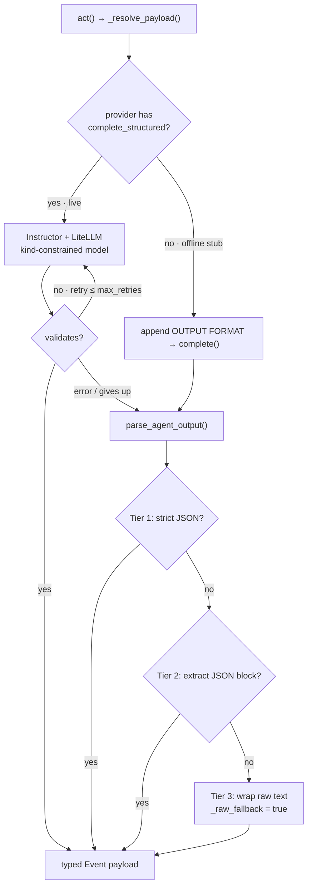

# Structured Output

## The problem with free prose

Small models drift when asked for free prose:
- They forget their role mid-response
- They output multiple sentences when one is needed
- The downstream router can't determine which event kind to assign
- Validation is hard — "did the model actually judge this, or just describe?"

The fix: **tell the model exactly what shape to output, every time**.

Two paths enforce the same `{kind, text, …}` contract (ADR-0016):

- **Live path — validated.** A Pydantic model whose `kind` is constrained to the
  agent's `may_emit` grant is requested via Instructor over the LiteLLM gateway;
  the model is retried until it validates. The payload is valid by construction,
  so the `_raw_fallback` tier below is never taken on the live path.
- **Offline path — tolerant parse.** The deterministic stub returns prose, so the
  `OUTPUT FORMAT` block is appended and `parse_agent_output` normalises whatever
  comes back. This keeps demos and tests fully offline with no dependency.

`ManifestAgent.act()` picks the path by capability: if the routed provider
exposes `complete_structured`, it uses the validated path; otherwise it falls
back to the prompt-and-parse path. Both feed the same `Event` construction, so
the conductor, ledger, and projections are identical either way.



---

## The constraint block

Every agent prompt ends with an `OUTPUT FORMAT` block:

```
OUTPUT FORMAT
Reply with a single JSON object and nothing else — no prose before or after.
Schema: {"kind": "...", "text": "..."}
kind must be one of: world.observed | judge.verdict
text must be one or two sentences, vivid and specific.
Example: {"kind": "world.observed", "text": "A mossy ticket booth opens in a tree root."}
```

This block is **not** provider-native tool/function-calling — it works with any
model on any inference endpoint because the constraint is in the prompt.

Validated structured output (enforced schema, retried, no parsing) is strictly
better when the transport supports it, and is what the live path uses (see
*Validated output* below). Prompt-based JSON + the parser is the universal
offline fallback that works everywhere.

---

## The parser

`parse_agent_output()` in `src/core/structured.py` implements a three-tier strategy:

### Tier 1: Direct JSON parse

```python
raw = '{"kind": "world.observed", "text": "The path folds itself into a paper crane."}'
# → clean parse, kind validation, return
```

### Tier 2: Extract embedded JSON

Some models prepend prose: `"Here is my response: {...}"`.
A regex extracts the first `{...}` block and attempts to parse it.

```python
raw = 'Certainly! Here is the JSON: {"kind": "agent.spoke", "text": "I collect echoes."}'
# → extracted and parsed
```

### Tier 3: Fallback wrap

If neither works, the raw text is wrapped in the fallback kind:

```python
raw = "The mushrooms charge admission to their bioluminescent shows."
# → {"kind": "agent.spoke", "text": "The mushrooms charge...", "_raw_fallback": True}
```

The `_raw_fallback` flag lets the system log how often the model isn't complying,
which is a signal that the prompt needs tuning or the model needs to be swapped.

This tier is the **offline** safety net (and the degrade path if a live
structured call fails). The live path uses validated structured output and never
admits prose as a typed event — see *Validated output* below.

---

## Kind validation

The parser enforces `may_emit` from the manifest:

```python
allowed = ["world.observed"]   # from manifest.may_emit
result = parse_agent_output(raw, allowed_kinds=allowed, fallback_kind="world.observed")
# if model emits "judge.verdict" → replaced with "world.observed"
```

This is the safety boundary: **an agent cannot emit an event kind it isn't authorised to emit**,
even if the model tries.  The critic cannot write to the scene; the scene-writer cannot judge.

---

## Extra payload fields

Agents can request additional fields by passing `extra_fields` to `json_instruction()`:

```python
json_instruction(
    allowed_kinds=["agent.spoke"],
    extra_fields=["emotion", "wants"]
)
# → schema includes "emotion" and "wants"
```

These fields are preserved in the event payload alongside `text` and `kind`.
They're useful for:
- Rendering emotional state in the UI
- Routing decisions (e.g. "if emotion=desperate, escalate to judge")
- Downstream agent context (the Echo agent could read the emitting agent's "wants")

---

## Testing structured output

Because the parser is a pure function, every compliance pattern is testable:

```python
# test_structured.py covers:
# - valid JSON parsed correctly
# - invalid kind replaced by fallback
# - JSON embedded in prose extracted
# - pure text wrapped in fallback kind
# - extra fields preserved
```

---

## Validated output (live path)

The live path enforces the schema instead of parsing it (ADR-0016).

### The constrained model

`build_output_model(allowed_kinds, extra_fields)` in `src/core/structured.py`
builds a Pydantic model from the agent's grant:

```python
model = build_output_model(allowed_kinds=["world.observed"], extra_fields=["emotion"])
# kind: Literal["world.observed"]   (a kind outside the grant fails validation)
# text: str                          (required)
# emotion: str                       (required, from output_extra_fields)
```

The `may_emit` boundary that the parser *coerced* is now enforced by the type: a
model literally cannot validate with a kind it isn't authorised to emit. The
function is pure Pydantic — no provider, no network — so it is unit-tested
directly and importable with the structured-output dependency absent.

### The structured call

`LiteLLMProvider.complete_structured(role, prompt, response_model)` wraps the
*same* `litellm.completion` the gateway already uses (ADR-0015) with
`instructor.from_litellm(...)` and asks for `response_model`:

```python
result, raw = client.create_with_completion(
    messages=[...], response_model=model, max_retries=2, ...
)
```

Instructor re-prompts on validation failure (bounded by `max_retries`); on
success it returns the validated instance *and* the raw completion, so tokens and
cost are read from that completion exactly as `complete()` does and continue to
feed the Governor. `instructor` is imported lazily; offline never reaches it.

### Path selection

`ManifestAgent.act()` delegates to `_resolve_payload(...)`:

```python
provider = self.router.for_profile(self.manifest.model_profile)
if hasattr(provider, "complete_structured"):
    result = provider.complete_structured(role, prompt, build_output_model(...))
    return result.model_dump()          # validated, no _raw_fallback
# else: deterministic stub -> json_instruction + parse_agent_output (offline)
```

If a live structured call raises, the agent degrades to the parser path so the
turn still produces an event. The rest of the system (manifest, conductor,
ledger) does not change — the value of keeping the contract in this layer, not in
the agent code.
