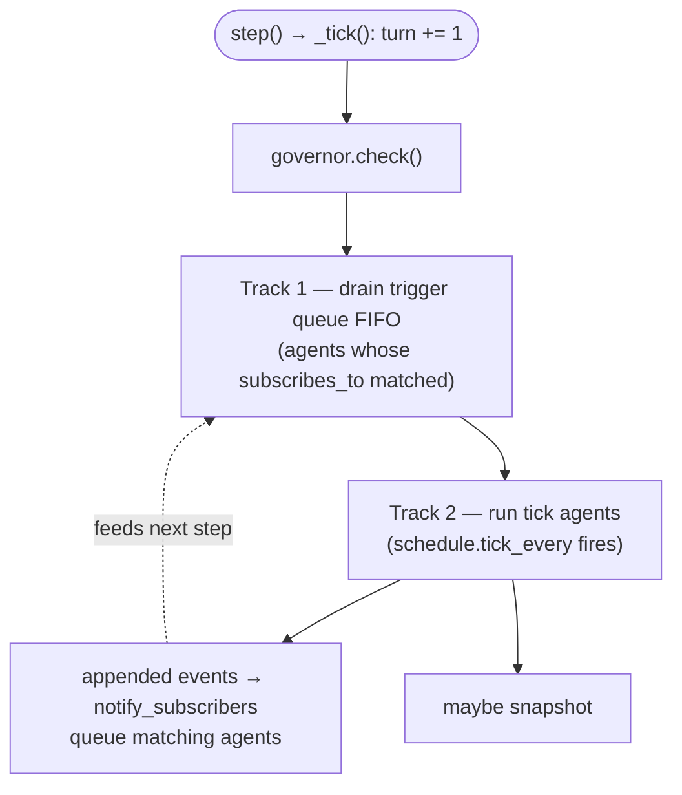

# Subscription-Based Event Routing

## Why subscriptions instead of schedules

The Phase 0/1 conductor scheduled agents by turn parity (`turn % 3`, `turn % 2`).
That's simple and fine for three agents.  It breaks when:
- You add more agents and the modulo arithmetic becomes arbitrary
- Some agents need to react *immediately* to specific events, not on their next tick
- You want to hibernated agents (not scheduled) to wake up when something relevant happens

Subscription routing solves all three: agents declare what they care about, and the
conductor routes accordingly.  Coupling is to the **event schema**, not to each other.

---

## The two-track hybrid schedule

The conductor runs **two tracks per step** in order:



### Track 1: Event-triggered (subscriptions)

When any event is appended to the ledger, the conductor checks which agents
have that event kind in `manifest.subscribes_to`.  Those agents are queued in
a FIFO trigger queue and execute **before** the next tick batch.

```python
def _notify_subscribers(self, event: Event) -> None:
    for agent in self.scenario.agents:
        if event.kind in agent.manifest.subscribes_to:
            self._trigger_queue.append((agent, event))
```

**Important properties**:
- A trigger fires once per triggering event (not per turn)
- The governor caps how many triggers can fire per turn (no cascade explosions)
- Triggers are consumed FIFO — the agent that subscribed first reacts first

**Example**: the Echo agent subscribes to `user.injected`.  When a visitor drops
something into the world, Echo is immediately queued and reacts this turn —
before the next scheduled tick.

### Track 2: Tick-based (manifest.schedule.tick_every)

After the trigger queue is drained, scheduled agents fire:

```yaml
schedule:
  tick_every: 3   # fire every 3rd turn regardless of subscriptions
```

`tick_every: None` = event-driven only (the agent never fires on a clock).
`tick_every: 0` = every turn.

Ticks and subscriptions are orthogonal.  An agent can have both.

### Legacy fallback

Agents without a manifest use the scenario's legacy `schedule(turn)` method.
This preserves full backward compatibility — Phase 0/1 agents work unchanged.

---

## Preventing cascades

Without limits, subscriptions create runaway chains:
- Agent A emits `X`
- Agent B subscribes to `X`, emits `Y`
- Agent C subscribes to `Y`, emits `Z`
- Agent A subscribes to `Z`... loop

The governor prevents this:
- `max_calls_per_turn`: hard cap on model calls per turn
- `max_consecutive` (manifest): max turns an agent acts in a row
- The trigger queue is drained at most once per step — agents added to the queue
  during a step's trigger processing fire on the **next** step, not immediately

---

## Subscription patterns by scenario type

### Divergent world-growth (Thousand Token Wood)

```
scene-whisperer → subscribes_to: [run.started, user.injected], tick: 3
mischief-critic → subscribes_to: [world.observed], tick: None
pocket-actor    → subscribes_to: [world.observed, judge.verdict], tick: 2
echo            → subscribes_to: [user.injected], tick: None
```

The critic fires immediately every time the scene changes.
The echo fires immediately every time a visitor drops something.
The pocket-actor and scene-whisperer run on ticks to keep a steady rhythm.

### Convergent mystery-solving (Mystery Roots)

```
clue-gatherer    → subscribes_to: [run.started, world.observed], tick: None
hypothesis-former → subscribes_to: [agent.thought], tick: None
devils-advocate  → subscribes_to: [agent.spoke], tick: None
mystery-judge    → subscribes_to: [], tick: 4   # periodic synthesis
```

The swarm is fully event-driven.  The judge fires periodically to synthesise.
Each clue triggers a hypothesis, each hypothesis triggers a challenge.
The governor ensures this chain terminates each turn.

---

## Adding a new agent

1. Create `src/agents/my_agent.py` with a manifest that declares subscriptions.
2. Add the agent to the scenario's `agents` tuple.
3. Done — no conductor or scheduler edits.

The routing is automatic: the conductor reads the manifest and wires up subscriptions
the first time an event of the subscribed kind appears in the ledger.
