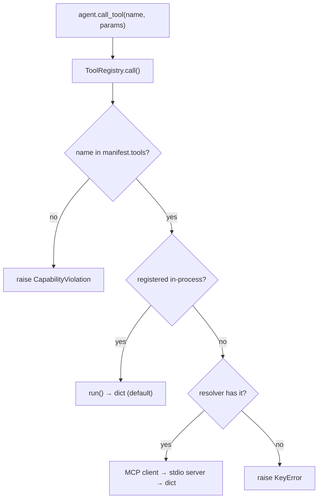

# Tool Contract

Tools are the fourth stable contract.  An agent never holds a tool directly; it
asks the `ToolRegistry`, which enforces the agent's capability grant before
dispatching.  "The Artist gets image-gen, the Critic does not" is enforced by the
runtime, not by convention.

## Shape

A tool is a `(name, description, run)` triple.  `run(**params)` returns a
JSON-serialisable dict that the calling agent folds into its emitted event.

```python
registry = ToolRegistry()
registry.register("oracle", "Draw a cryptic omen. Params: {seed: str}.", oracle_fn)
```

## Capability enforcement

```python
registry.call(agent_name, manifest, tool, params)
#  raises CapabilityViolation  if tool not in manifest.tools
#  raises KeyError             if tool is granted but not registered
#  else -> tool's dict result
```

`ManifestAgent` wraps this as `self.call_tool(name, **params)` and injects the
descriptions of granted tools into the prompt (`AVAILABLE TOOLS` block).

## Worked example: the oracle path

`oracle-grove` pairs a tool-using agent with a tool-less one:

```
fortune-teller   handler: fortune-teller   tools: [oracle]   emits: oracle.spoke
scene-whisperer  (generic)                 tools: []         emits: world.observed
```

`FortuneTeller` (`src/agents/handlers.py`) calls the deterministic `oracle` tool,
weaves the omen into its prompt, and records the omen on the event payload — so
the tool output is first-class ledger data.  `scene-whisperer` has no grant, so a
call would raise `CapabilityViolation`.  `tests/test_tools.py` proves both.

## Transports: in-process and MCP (ADR-0017, realized)

The `(name, description, run)` interface fronts an in-process callable **and** a
tool running out-of-process over the Model Context Protocol (MCP) — same contract,
swappable transport, invisible to agents.  The capability check is the security
boundary; MCP is only transport.



The capability check (node C) runs **first** — before any transport is touched —
so swapping in-process for MCP never weakens the security boundary.

`ToolRegistry.call(...)` enforces `tool in manifest.tools` and raises
`CapabilityViolation` on a denied call **before any transport is touched** — then
dispatches in-process if the tool is registered locally, otherwise to an attached
`ToolResolver` (the MCP client).  `describe()` prefers in-process descriptions and
falls back to the resolver's, so prompt assembly is identical across transports.

### Config gate

`default_tool_registry()` is in-process by default.  Set one of these to resolve
granted tools over MCP instead (the grant check is unchanged either way):

- `MCP_SERVERS` — `::`-separated stdio command lines, e.g.
  `MCP_SERVERS="python -m src.tools.mcp_server"` or
  `MCP_SERVERS="python -m src.tools.mcp_server :: node other-server.js"`.
- `MCP_ORACLE=1` — shorthand for the built-in oracle server
  (`python -m src.tools.mcp_server`); ignored when `MCP_SERVERS` is set.

With neither set the registry stays fully in-process — the offline default the
test-suite exercises.  `mcp` is an optional extra (`pip install -e '.[mcp]'`) and
is imported lazily, so `import src.*` and `import app` work with it not installed.

The server exposes the *same* `oracle` implementation, so for a given seed the
omen drawn over MCP is byte-identical to the in-process one: `oracle-grove`
produces the same ledger in both modes.

## Code

- `src/tools/registry.py` — `ToolRegistry`, `ToolSpec`, `CapabilityViolation`, `ToolResolver`
- `src/tools/builtins.py` — `oracle`, `default_tool_registry()` (MCP config gate)
- `src/tools/mcp_server.py` — FastMCP stdio server exposing the built-in tools
- `src/tools/mcp_client.py` — `MCPToolClient`, `MCPResolver`, env gate (`mcp_resolver_from_env`)
- `src/agents/handlers.py` — `FortuneTeller` (handler that calls a tool)
- `config/agents/fortune-teller.yaml`, `config/scenarios/oracle-grove.yaml`
- `tests/test_tools.py` (in-process), `tests/test_mcp.py` (transport + capability)
