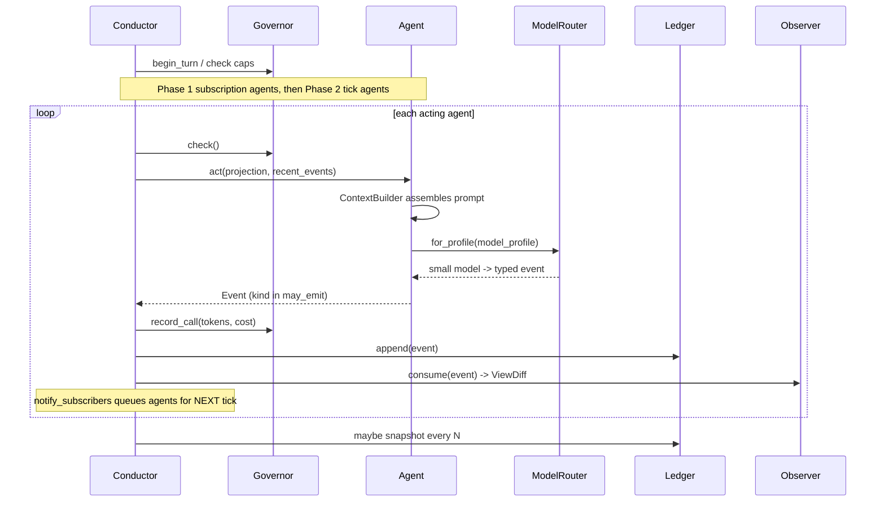

# Turn Lifecycle

One sim-tick, end to end.  `Conductor.step(n_ticks=1)` runs this loop; the model
is stateless and all state is passed in per turn.



```text
 0. step(n_ticks=N): repeat the tick body N times (two-clock: wall-clock maps to N).
 1. _tick(): turn += 1; governor.begin_turn(); governor.check() (turn/call/token caps).
 2. Phase 1 — subscription agents: anything queued because an event they
    subscribe_to landed last tick now acts (FIFO).
 3. Phase 2 — tick agents: agents whose schedule.tick_every fires this turn act.
 4. For each acting agent (_run_agent):
      a. governor.check()
      b. ContextBuilder assembles the prompt:
         IDENTITY · SHARED GOAL · CURRENT SCENE · YOUR MEMORY · VISITOR [· EXTRA · TOOLS · OUTPUT FORMAT]
         (memory = episodic window or salience-ranked top-k, per manifest)
      c. ModelRouter.for_profile(manifest.model_profile) -> the agent's small model
      d. model returns text; structured.py parses JSON (kind ∈ may_emit, else fallback)
      e. governor.record_call(tokens=provider.last_usage)   # budget metering
      f. ledger.append(event)  (idempotent, ordered)
      g. observer.consume(event) -> ViewDiff; projection.apply(event)
      h. _notify_subscribers(event): queue agents subscribed to event.kind for next tick
 5. _maybe_snapshot(): if snapshot_every hit and ledger is SQLite, checkpoint.
 6. Reflection: when an agent's reflection_threshold is reached, it emits
    agent.reflected (a compacted belief) instead of acting on the world that turn.
 7. UI renders projection, ledger, stats, and the live config panel.
```

## Notes

- **Indirect communication.** Agents never call each other; they append events
  and subscribe to kinds.  Adding an agent changes nothing else.
- **Cascade safety.** A subscription fires on the *next* tick, not recursively
  within the turn; the Governor's per-turn cap bounds any fan-out.
- **Legacy fallback.** Agents without a manifest fall back to the scenario's
  `schedule()` method (Phase-0/1 compatibility); manifest agents are routed by
  subscriptions + ticks.
