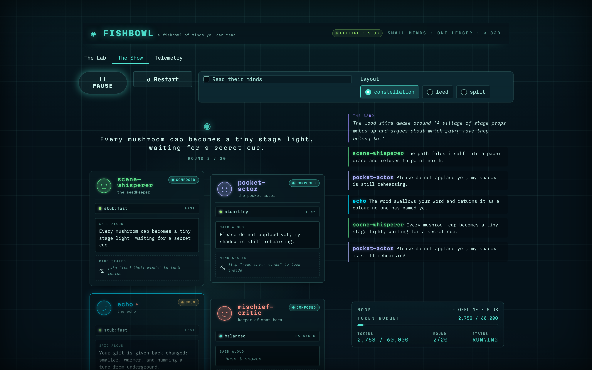

# Field Notes from the Thousand Token Wood

*A five-part series on building Multi-Agent Land — a forest theater run by small AI models — for the Thousand Token Wood hackathon.*

---

The whole project rests on one idea: **small specialist models that never call each other**.
They post typed events to a shared, append-only ledger, and every view of the world — the
stage, each agent's memory, the scrub-anywhere replay, the exported trace — is a pure
projection of that one log. One engine, many worlds, every model under 32 billion parameters.

This series tells the story from the outside in. Start at the top for the pitch; keep reading
to descend, one layer at a time, into the internals — the context that shapes what each model
sees, and the ledger that doubles as the database. Read it straight through, or jump to the
part that matches how deep you want to go.

## The series

- **[Part 1 · Three Worlds, One Engine](01-three-worlds-one-engine.md)** — *non-technical.*
  What Multi-Agent Land is in plain language, and why a troupe of tiny specialists beats one
  big model.
- **[Part 2 · Six Playable Woods and a Fishbowl to Watch Them](02-the-woods-and-the-fishbowl.md)**
  — *product.* A tour of the eight scenarios and the theater — MindCards, mind-reading, moods,
  and scrub-anywhere replay.
- **[Part 3 · One Engine, Three Costumes](03-one-engine-three-costumes.md)** — *architecture.*
  The four abstractions — ledger, conductor, agents, projections — that let one engine wear
  every world.
- **[Part 4 · How a Small Agent Decides What to Say](04-how-a-small-agent-decides.md)** —
  *deep technical.* Context assembly and the three-layer memory stack: what a model actually
  reads before it speaks.
- **[Part 5 · The Ledger Is the Database](05-the-ledger-is-the-database.md)** — *deep
  technical.* How an append-only log of typed events becomes the store, the checkpoint, the
  trace, and a 24-hour run that doesn't break the bank.

## Also in this folder

- **[The Wood Has Grown: A State of the Engine](state-of-the-wood.md)** — a dated milestone
  snapshot of what shipped, what broke, and what's next. A companion to the series, not part
  of its numbered arc.

---

*This is the front door. Begin with [Part 1](01-three-worlds-one-engine.md).*
