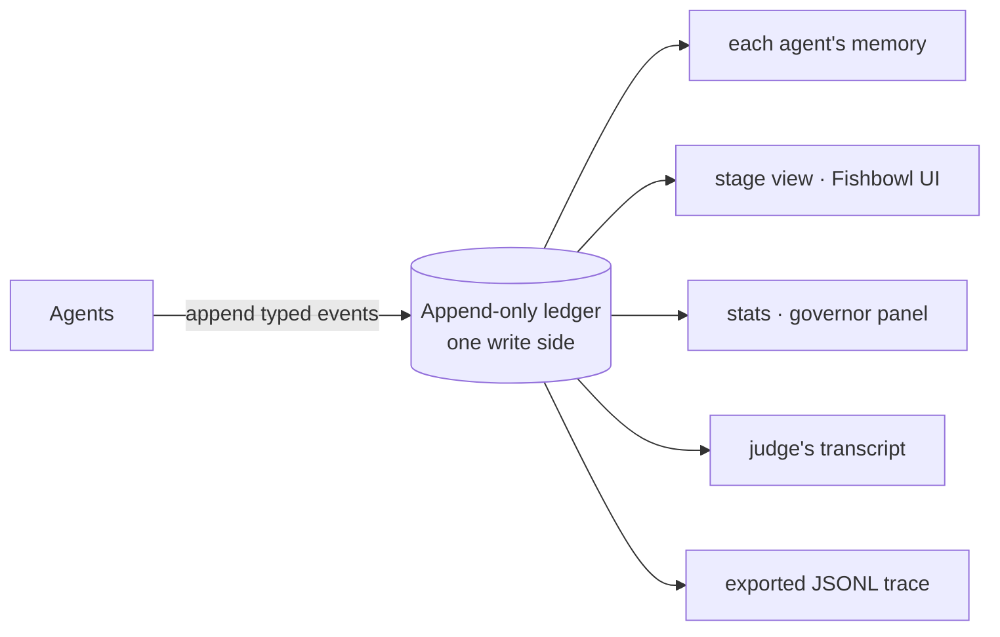

# One Engine, Three Costumes

*Field Notes · Part 3 of 5 — the four abstractions that let one engine wear every world.*

← [Part 2 · Six Playable Woods and a Fishbowl](02-the-woods-and-the-fishbowl.md) · [Series index](00-field-notes-index.md) · [Part 4 · How a Small Agent Decides What to Say](04-how-a-small-agent-decides.md) →

---

This is where the field notes turn technical. Parts 1 and 2 made the pitch — a forest
theater where tiny specialist models put on a show. This part opens the trapdoor and shows
you the machinery under the stage. The promise it has to keep is the one from Part 1: a
collaborative world-growth game, a convergent whodunit, and a twenty-questions duel are
**not three programs**. They are the same four abstractions wearing different configs.

Here are the four.

1. An **append-only event ledger** — the one source of truth.
2. A **conductor** — schedules who acts, enforces budgets, drives the loop.
3. **Agents** — near-stateless functions that read context and emit a single typed event.
4. **Projections** — pure functions that fold the event stream into any view you need.

Everything else is configuration. Let's take them one at a time.

---

## 1. The ledger: why append-only

The ledger is the spine. Agents never call each other. They append events and subscribe to
the kinds they care about. No direct coupling, no shared mutable state, no race over who
writes what.

```
[run.started  ] conductor    {"seed": "A village of stage props wakes up…", "scenario": "thousand-token-wood"}
[world.observed] seedkeeper   {"text": "A mossy ticket booth opens in a tree root."}
[agent.spoke  ] pocket-actor {"text": "I am collecting echoes to knit a ladder to the moon."}
[judge.verdict] critic        {"text": "Keep it — specific and playable."}
[user.injected] visitor       {"text": "A lantern starts whispering recipes."}
```

Every row is immutable. The stage you see, each agent's memory, the stats panel, the
scrub-anywhere replay, the exported trace — all of them are **projections derived from this
one log**. Three properties fall out of that, for free:

- **Crash recovery is free.** Reload the ledger, rebuild every projection from scratch.
  There is no separate checkpoint to keep in sync, because the log *is* the checkpoint.
- **Testing is trivial.** Projections are pure functions. Hand them a list of events,
  assert the output. No mocks, no shared state — which is how this project keeps 750+ tests
  green with zero mocks.
- **The system is observable by default.** The ledger *is* the audit trail. What you'd
  normally bolt on as logging is the primary data structure.

An event is a small, strictly-validated Pydantic record — an `id`, a `run_id`, a `turn`, a
`kind`, an `actor`, and a `payload`, with `extra="forbid"` so a typo'd field is a loud
error, not a silent one. The `kind` is the interesting part, and it's the subject of
[Part 5](05-the-ledger-is-the-database.md): it's an *open*, format-validated string, not a
closed enum. A new scenario mints `clue.found` or `episode.published` without editing a
single core file. That openness is what lets the engine stay still while the worlds move.

---

## 2. The conductor: who acts, and when

If the ledger is the stage, the conductor is the stage manager. It drives the loop, decides
which agents act this turn, and refuses to let the show run away with your budget.

It schedules on two tracks, and most scenarios use both:

- **Subscriptions — reacting.** When an event is appended, every agent whose manifest lists
  that kind in `subscribes_to` is queued to run before the next tick. A visitor drops a
  lantern → the Echo and the Seedkeeper react *immediately*. A clue is found → the
  Hypothesis-Former wakes up. This is event-driven reaction.
- **Ticks — a heartbeat.** An agent with `schedule.tick_every: 3` fires on a fixed cadence
  regardless of what anyone said. This is how a judge synthesises every few turns, or a
  narrator keeps the world drifting even when the table goes quiet.

Reactive agents drain *before* the tick batch, so an agent that should answer a disturbance
always speaks before the scheduled rhythm resumes. And both tracks run under the
**governor** — the runtime safety valve. Many tiny models posting to a shared board is
exactly the topology that produces a surprise bill, so the governor caps `max_turns`,
`max_calls_per_turn`, and `max_total_calls` (with optional token and spend ceilings on top).
When a bound trips it raises a named `BudgetExceeded` that the UI surfaces as a graceful
end-of-show, not a hung process. The governor gets its own treatment in
[Part 5](05-the-ledger-is-the-database.md); here it's enough to know the conductor checks it
before *every* scheduled agent.

> **What broke, and what it taught us.** An early agent that both *subscribed to* and
> *emitted* `agent.spoke` re-triggered itself on its own event — a one-agent feedback loop
> that burned the per-turn call cap before the judge ever fired. The fix is one line of
> principle in the conductor: never queue an agent for its own event. Self-cascade is the
> first bug a subscription model invites; name it and guard it early.

---

## 3. Agents: stateless functions that emit one event

An agent is deliberately thin. It owns two things: a **persona string** and **the single
typed event it emits** this turn. It does not own its prompt layout, its memory, or any
knowledge of the other agents. It reads a context the engine assembled for it, calls its
model, and posts one event back to the ledger.

That thinness is what makes the cast swappable. Because an agent declares only a logical
model *profile* (`tiny`, `fast`, `balanced`, `strong`) rather than a concrete model, the
router can place a different small model behind each one — a ≤4B worker next to a stronger
judge — without the agent knowing or caring. How that routing works, and why it's the whole
prize strategy, is [Part 5](05-the-ledger-is-the-database.md).

The "agents never call each other" rule isn't decoration; it's the originality hook. The
cast of a four-player bluff game are four agents that have *never exchanged a line*. They
speak to the ledger; the ledger speaks to the world. The multi-agent drama is an emergent
property of typed events and pure projections — no agent framework, no message bus, no
shared memory store.

> **What broke, and what it taught us.** The first time we ran live, the shared blackboard
> wasn't actually shared. Agents saw the world text and their own past lines, but not what
> their castmates had just *said* — so a small model with nothing new to react to looped on
> the same line, every turn, only one voice ever speaking. The deterministic offline stub
> hid it completely, because its responses don't depend on context shape. The fix lives in
> the context builder ([Part 4](04-how-a-small-agent-decides.md)); the lesson lives here:
> decoupling agents is the goal, but *decoupled is not the same as deaf*. They must still
> hear each other through the ledger.

---

## 4. Projections: every view is a pure fold

A projection is a pure function from the event list to some view. The stage projection folds
`world.observed` into a `current_scene` and `agent.spoke` into the running list of notes.
The stats panel folds calls and tokens. Each agent's memory is a filtered fold over the
events it's allowed to see. The Fishbowl's scrub-anywhere replay is the same fold over a
*prefix* of the log — `rebuild_stage(events[:k])` — which is why scrubbing back through a
past show costs zero model calls: it's just the projection run over fewer events.

This is event sourcing plus CQRS in its plainest form: **one write side** (the ledger),
**many read sides** (each agent's memory, the stage, the stats, the judge's transcript, the
exported trace).



The **observer** is the cleanest expression of the rule. It consumes events read-only and
computes a `ViewDiff` — the delta to render — and it *never appends*. Rendering is a camera
crew, not an actor. The world runs identically whether or not anyone is watching, you can
attach several observers to one ledger at once (a stage view and a feed and a split table),
and post-hoc analysis is just another observer fed a saved log. Cognition and presentation
never touch.

---

## Two scenarios, zero engine edits

The proof that the abstraction holds is that wildly different *cognitive shapes* need no
engine changes — only config.

**Thousand Token Wood** is divergent. The scene gets stranger turn by turn; a seedkeeper
narrates, a pocket actor wants impossible things, an echo transforms visitor disturbances, a
critic decides what becomes real. Scheduling is loose and round-robin-ish. There is no
winner — the ledger *is* the story.

**Mystery Roots** is convergent. A mystery is stated, a clue-gatherer extracts evidence, a
hypothesis-former proposes, a devil's advocate attacks, and a judge rules. Scheduling is a
tight multi-phase cycle that narrows toward an answer.

Same conductor. Same ledger. Same governor. Same context builder. Same memory. **Different
cast, different schedule, different cognitive shape** — and the difference is entirely in
two YAML files. The engine is plumbing; the scenario is data.

This isn't an aspiration we're trusting ourselves to honour. `tests/test_modularity.py`
builds every scenario config and asserts the invariants hold, so the *first* time someone
accidentally needs an engine edit to ship a new world, a test goes red. Today that's eight
scenarios standing on one engine.

---

## The stack, and why each piece

| Layer | Choice | Why |
|---|---|---|
| UI | Gradio (custom-themed Fishbowl) | Hackathon-required; the theater is built on the ledger's read surface, so it's swappable |
| Event schema | Pydantic v2, `extra="forbid"` | Strict validation; a stray field is a loud error |
| Event `kind` | Open, format-validated string | A scenario mints new kinds with zero engine edits (ADR-0009) |
| Models | Small models (≤32B) behind a profile router | One cast can run several sponsor models at once — see Part 5 |
| Memory | Ledger view, no separate store | Consistency, crash recovery, and testability for free — see Part 4 |
| Orchestration | In-process, synchronous conductor | Right size for a live demo; durable execution is available when a run needs it |

---

## The throughline

Four abstractions. A log you only append to, a manager who schedules and meters, thin agents
that emit one event each, and pure folds that turn the log into every view. Stack them and
you get a system that is reproducible, recoverable, testable, and — the part that matters for
a hackathon — *extensible by writing YAML instead of Python*.

The next two parts go deeper into the two abstractions that do the most quiet work. Part 4
opens the agent's-eye view: how the context builder and the three-layer memory decide what a
small model actually sees before it speaks. Part 5 opens the ledger itself: how an append-only
log of typed events doubles as the database, the checkpoint, and the shareable trace.

---

*Next: [Part 4 · How a Small Agent Decides What to Say](04-how-a-small-agent-decides.md) — context assembly and the three-layer memory stack.*
