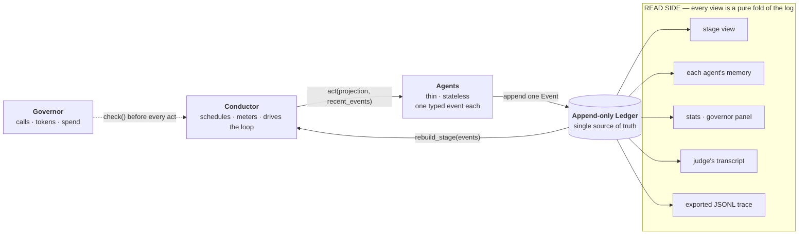
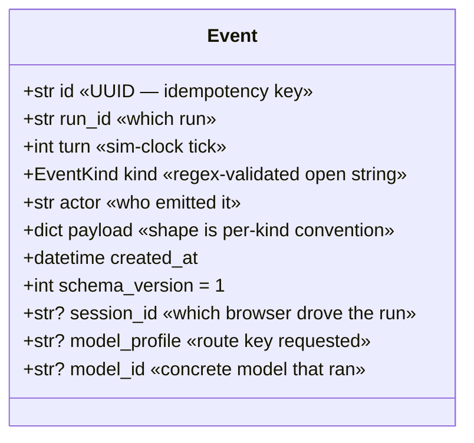
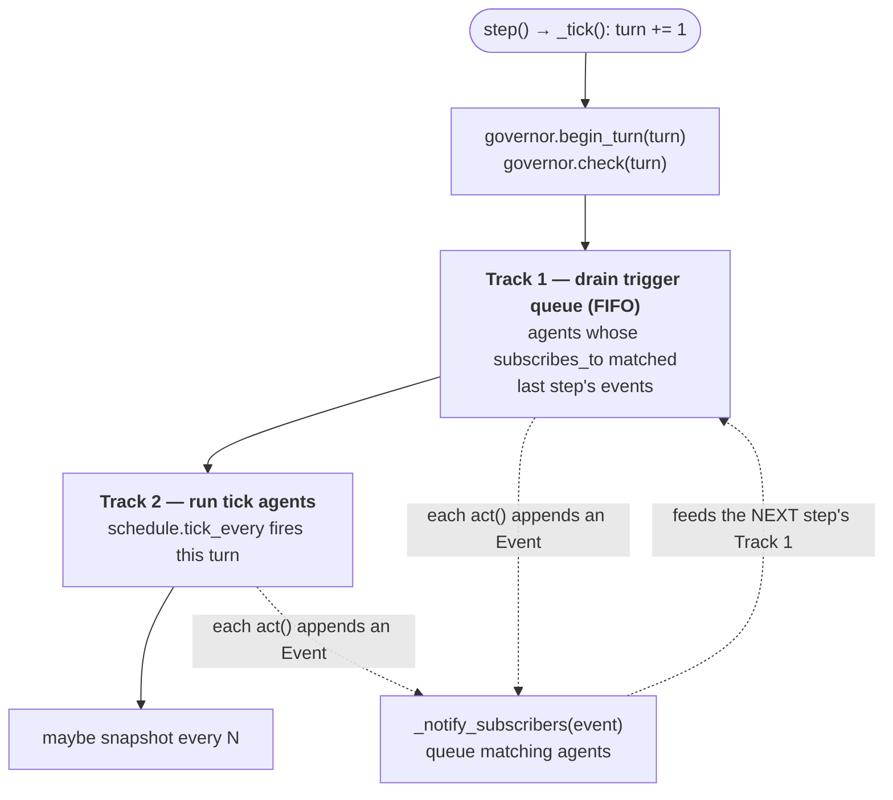
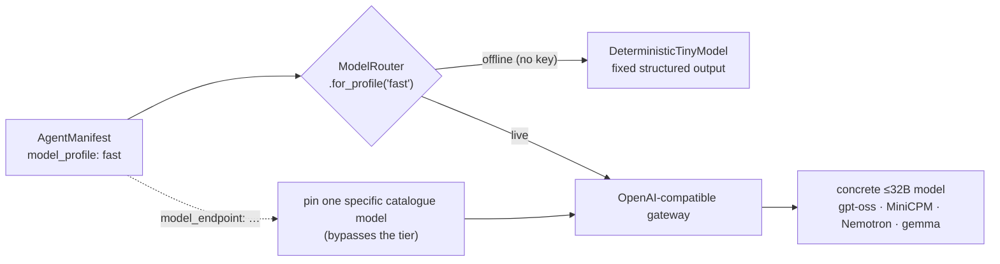
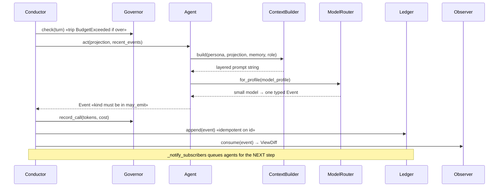
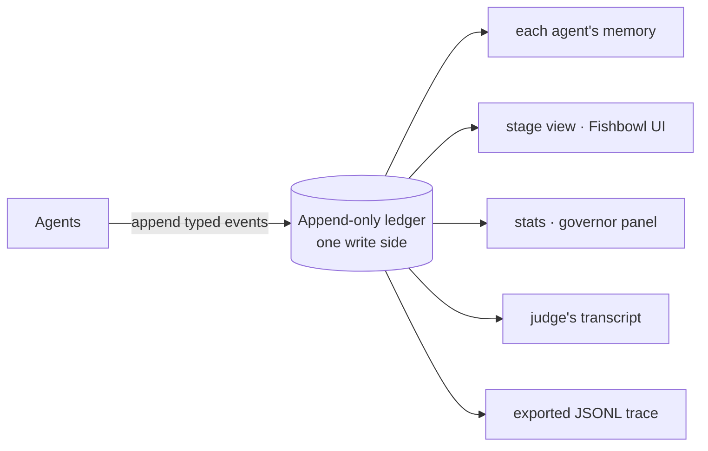
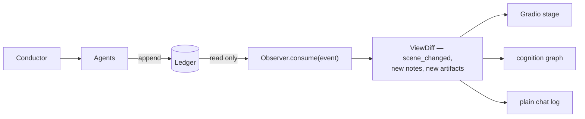
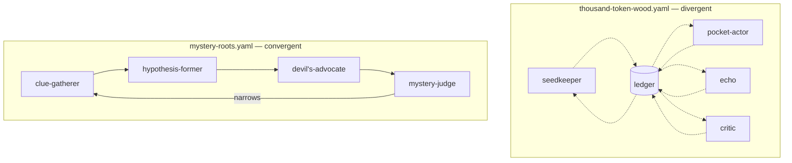

# One Engine, Three Costumes

*Field Notes · Part 3 of 5 — the four abstractions that let one engine wear every world.*

← [Part 2 · Six Playable Woods and a Fishbowl](02-the-woods-and-the-fishbowl.md) · [Series index](00-field-notes-index.md) · [Part 4 · How a Small Agent Decides What to Say](04-how-a-small-agent-decides.md) →

---

This is where the field notes turn technical. Parts 1 and 2 made the pitch — a forest
theater where tiny specialist models put on a show. This part opens the trapdoor and shows
you the machinery under the stage. The promise it has to keep is the one from Part 1: a
collaborative world-growth game, a convergent whodunit, and a twenty-questions duel are
**not three programs**. They are the same four abstractions wearing different configs.

Here are the four.

1. An **append-only event ledger** — the one source of truth.
2. A **conductor** — schedules who acts, enforces budgets, drives the loop.
3. **Agents** — near-stateless functions that read context and emit a single typed event.
4. **Projections** — pure functions that fold the event stream into any view you need.

Everything else is configuration. And the shape of how they fit together is the whole
design — one write side, one scheduler, thin emitters, and many pure reads:



The arrows only ever point one way into the ledger: **agents append, everything else reads.**
There is no arrow from an agent to another agent. Hold that picture; the rest of this part is
the four boxes, one at a time.

---

## 1. The ledger: why append-only

The ledger is the spine. Agents never call each other. They append events and subscribe to
the kinds they care about. No direct coupling, no shared mutable state, no race over who
writes what.

```
[run.started  ] conductor    {"seed": "A village of stage props wakes up…", "scenario": "thousand-token-wood"}
[world.observed] seedkeeper   {"text": "A mossy ticket booth opens in a tree root."}
[agent.spoke  ] pocket-actor {"text": "I am collecting echoes to knit a ladder to the moon."}
[judge.verdict] critic        {"text": "Keep it — specific and playable."}
[user.injected] visitor       {"text": "A lantern starts whispering recipes."}
```

Every row is immutable. The stage you see, each agent's memory, the stats panel, the
scrub-anywhere replay, the exported trace — all of them are **projections derived from this
one log**. Three properties fall out of that, for free:

- **Crash recovery is free.** Reload the ledger, rebuild every projection from scratch.
  There is no separate checkpoint to keep in sync, because the log *is* the checkpoint.
- **Testing is trivial.** Projections are pure functions. Hand them a list of events,
  assert the output. No mocks, no shared state — which is how this project keeps 750+ tests
  green with zero mocks.
- **The system is observable by default.** The ledger *is* the audit trail. What you'd
  normally bolt on as logging is the primary data structure.

### The event envelope

An event is a small, strictly-validated Pydantic v2 record with `extra="forbid"`, so a
typo'd field is a loud error, not a silent one. The whole envelope is flat — no nesting, no
inheritance:



The `kind` is the interesting part, and it's the subject of
[Part 5](05-the-ledger-is-the-database.md): it's an *open*, format-validated string, not a
closed enum. A field validator enforces a lowercase, dot-namespaced shape —

```python
_KIND_RE = re.compile(r"^[a-z][a-z0-9]*(?:\.[a-z][a-z0-9]*)+$")  # "agent.spoke", "clue.found"

@field_validator("kind")
@classmethod
def _validate_kind(cls, value: str) -> str:
    if not is_valid_kind(value):
        raise ValueError(f"invalid event kind {value!r}")
    return value
```

— but the *set* of kinds is open. A new scenario mints `clue.found` or `episode.published`
without editing a single core file; the schema validates the *shape* of a kind, while each
agent's `manifest.may_emit` governs the *authority* to emit one. That split — open shape,
scoped authority — is what lets the engine stay still while the worlds move.

### One write path, idempotent by id

There is exactly one mutation in the system: `append`. It's a list and a set, and it's
idempotent against the event's UUID so a retried conductor step can't double-write:

```python
def append(self, event: Event) -> Event:
    if event.id in self._seen_ids:   # already have it — no-op
        return event
    self._events.append(event)
    self._seen_ids.add(event.id)
    return event
```

The in-memory version above is the offline default; a `SqlAlchemyLedger` implements the
*same* contract over SQLite or Postgres. How one contract drives two backends, and why
ordering uses a server-assigned offset rather than the id, is [Part 5](05-the-ledger-is-the-database.md).

---

## 2. The conductor: who acts, and when

If the ledger is the stage, the conductor is the stage manager. It drives the loop, decides
which agents act this turn, and refuses to let the show run away with your budget.

It schedules on two tracks, and most scenarios use both:

- **Subscriptions — reacting.** When an event is appended, every agent whose manifest lists
  that kind in `subscribes_to` is queued to run before the next tick. A visitor drops a
  lantern → the Echo and the Seedkeeper react *immediately*. A clue is found → the
  Hypothesis-Former wakes up. This is event-driven reaction.
- **Ticks — a heartbeat.** An agent with `schedule.tick_every: 3` fires on a fixed cadence
  regardless of what anyone said. This is how a judge synthesises every few turns, or a
  narrator keeps the world drifting even when the table goes quiet.

The two tracks run in a fixed order every step. Reactive agents drain *first*, so an agent
that should answer a disturbance always speaks before the scheduled rhythm resumes:



The queueing rule is one method, and it carries the single most important guardrail in the
whole scheduler — *never queue an agent for its own event*:

```python
def _notify_subscribers(self, event: Event) -> None:
    for agent in self.scenario.agents:
        if event.actor == agent.name:          # never react to yourself
            continue
        if event.kind in agent.manifest.subscribes_to:
            self._trigger_queue.append((agent, event))
```

Both tracks run under the **governor** — the runtime safety valve. Many tiny models posting
to a shared board is exactly the topology that produces a surprise bill, so the governor caps
calls and spend on five axes, checked before *every* scheduled agent:

```python
@dataclass
class Governor:
    max_turns: int = 100              # the show ends after N turns
    max_calls_per_turn: int = 8       # no single turn fires more than N model calls
    max_total_calls: int = 500        # whole-run call cap
    max_total_tokens: int | None = None   # optional token ceiling
    hourly_budget_usd: float | None = None # optional spend ceiling
```

When a bound trips it raises a named `BudgetExceeded(reason=...)` that the conductor turns
into a graceful `run.finished` rather than a hung process. The governor gets its own
treatment in [Part 5](05-the-ledger-is-the-database.md); here it's enough to see it sits on
the control path, not beside it — `max_calls_per_turn` is also what makes the subscription
model safe, because it bounds the fan-out a single cascade can produce within one turn.

> **What broke, and what it taught us.** An early agent that both *subscribed to* and
> *emitted* `agent.spoke` re-triggered itself on its own event — a one-agent feedback loop
> that burned the per-turn call cap before the judge ever fired. The fix is the
> `event.actor == agent.name` line above: never queue an agent for its own event.
> Self-cascade is the first bug a subscription model invites; name it and guard it early.

---

## 3. Agents: stateless functions that emit one event

An agent is deliberately thin. The base interface is a single method — read the context the
engine assembled, emit one typed event:

```python
class Agent(ABC):
    name: str

    @abstractmethod
    def act(
        self,
        run_id: str,
        turn: int,
        projection: StageProjection,      # the current stage, folded from the log
        recent_events: tuple[Event, ...], # the window it's allowed to see
    ) -> Event:                            # exactly one event back
        ...
```

It owns two things: a **persona string** and **the single typed event it emits** this turn.
It does not own its prompt layout, its memory, or any knowledge of the other agents. The
concrete `ManifestAgent` is driven entirely by a YAML manifest — persona, what it subscribes
to, what it may emit, its schedule, and crucially, a *logical model profile* rather than a
concrete model:

```yaml
name: clue-gatherer
role: worker
persona: >
  You are a careful Clue Gatherer. Extract exactly one new, concrete clue
  from the current scene.
subscribes_to: []
may_emit: [agent.spoke]
schedule:
  tick_every: 1
model_profile: fast        # tiny ≤4B · fast ≤7B · balanced ≤13B · strong ≤32B
memory:
  window: 8
```

That `model_profile` is the swap point. Because an agent declares only a *profile*, the
`ModelRouter` can place a different small model behind each one — a ≤4B worker next to a
stronger judge — without the agent knowing or caring:



The router is the single place a model is ever named — which is why one cast can legitimately
run several different sponsor models in the same show, and why offline every profile resolves
to a deterministic stub so the demo runs with no key. The routing tiers, the decoding configs,
and why that's the whole prize strategy are [Part 5](05-the-ledger-is-the-database.md).

The "agents never call each other" rule isn't decoration; it's the originality hook. The
cast of a four-player bluff game are four agents that have *never exchanged a line*. They
speak to the ledger; the ledger speaks to the world. The multi-agent drama is an emergent
property of typed events and pure projections — no agent framework, no message bus, no
shared memory store.

> **What broke, and what it taught us.** The first time we ran live, the shared blackboard
> wasn't actually shared. Agents saw the world text and their own past lines, but not what
> their castmates had just *said* — so a small model with nothing new to react to looped on
> the same line, every turn, only one voice ever speaking. The deterministic offline stub
> hid it completely, because its responses don't depend on context shape. The fix lives in
> the context builder ([Part 4](04-how-a-small-agent-decides.md)); the lesson lives here:
> decoupling agents is the goal, but *decoupled is not the same as deaf*. They must still
> hear each other through the ledger.

### One turn, end to end

The four abstractions only become a *show* when they run in sequence. Here is a single
acting agent, from the conductor's `check()` to the rendered diff — the loop that repeats
until the governor calls time:



Cognition (the agent + router) and bookkeeping (governor + ledger) and presentation (the
observer) are three separate concerns strung on one append. None of them know about the
others; they only know the event.

---

## 4. Projections: every view is a pure fold

A projection is a pure function from the event list to some view. The whole stage is one
small reducer — fold each event into a mutable snapshot:

```python
def rebuild_stage(events: tuple[Event, ...], run_id: str | None = None) -> StageProjection:
    projection = StageProjection()
    if run_id is not None:
        events = tuple(e for e in events if e.run_id == run_id)
    for event in events:
        projection.apply(event)     # world.observed → current_scene; agent.spoke → notes; …
    return projection
```

The stats panel folds calls and tokens. Each agent's memory is a filtered fold over the
events it's allowed to see. The Fishbowl's scrub-anywhere replay is the same fold over a
*prefix* of the log — `rebuild_stage(events[:k])` — which is why scrubbing back through a
past show costs zero model calls: it's just the projection run over fewer events.

This is event sourcing plus CQRS in its plainest form: **one write side** (the ledger),
**many read sides** (each agent's memory, the stage, the stats, the judge's transcript, the
exported trace).




*The Show is just one read side: the stage, the cards, the feed, and the meters are all pure projections of the same append-only log.*

### The observer: a camera crew, never an actor

The **observer** is the cleanest expression of the rule. It consumes events read-only and
computes a `ViewDiff` — the delta to render — and it *never appends*:

```python
def consume(self, event: Event) -> ViewDiff:
    prev_scene = self._view.current_scene
    prev_notes = list(self._view.agent_notes)
    self._view.apply(event)               # advance the read-side snapshot
    diff = ViewDiff(
        scene_changed=self._view.current_scene != prev_scene,
        new_agent_notes=[n for n in self._view.agent_notes if n not in prev_notes],
        # … new_judge_notes, new_user_artifacts
    )
    if diff.has_changes:
        for cb in self._callbacks:        # push to UI / SSE / WebSocket
            cb(diff)
    return diff
```



Rendering is a camera crew, not an actor. The world runs identically whether or not anyone
is watching, you can attach several observers to one ledger at once (a stage view and a feed
and a split table), and post-hoc analysis is just another observer fed a saved log. Cognition
and presentation never touch.

---

## Two scenarios, zero engine edits

The proof that the abstraction holds is that wildly different *cognitive shapes* need no
engine changes — only config. Two scenarios, two YAML files, opposite scheduling topologies
on the *same* conductor:



**Thousand Token Wood** is divergent. The scene gets stranger turn by turn; a seedkeeper
narrates, a pocket actor wants impossible things, an echo transforms visitor disturbances, a
critic decides what becomes real. Scheduling is loose and round-robin-ish. There is no
winner — the ledger *is* the story.

**Mystery Roots** is convergent. A mystery is stated, a clue-gatherer extracts evidence, a
hypothesis-former proposes, a devil's advocate attacks, and a judge rules. Scheduling is a
tight multi-phase cycle that narrows toward an answer. The difference between the two lives
entirely in their config — cast list, schedule, and a `competition` block:

```yaml
# mystery-roots.yaml            # twenty-sprouts.yaml
cast:                           cast:
  - clue-gatherer                 - sprout-guesser
  - hypothesis-former             - secret-keeper
  - devils-advocate               - sprout-judge
  - mystery-judge               competition:
competition:                      kind: versus
  kind: judged                    teams:
                                    guesser: [sprout-guesser]
                                    keeper: [secret-keeper]
```

Same conductor. Same ledger. Same governor. Same context builder. Same memory. **Different
cast, different schedule, different cognitive shape** — and the difference is entirely in
those YAML files. The engine is plumbing; the scenario is data.

This isn't an aspiration we're trusting ourselves to honour. `tests/test_modularity.py`
builds every scenario config and asserts the invariants hold, so the *first* time someone
accidentally needs an engine edit to ship a new world, a test goes red. Today that's eight
scenarios standing on one engine.

---

## The stack, and why each piece

| Layer | Choice | Why |
|---|---|---|
| UI | Gradio (custom-themed Fishbowl) | Hackathon-required; the theater is built on the ledger's read surface, so it's swappable |
| Event schema | Pydantic v2, `extra="forbid"` | Strict validation; a stray field is a loud error |
| Event `kind` | Open, regex-validated string | A scenario mints new kinds with zero engine edits (ADR-0009) |
| Authority to emit | Per-agent `manifest.may_emit` | Open *shape*, scoped *authority* — shape and permission are decoupled |
| Scheduling | Two-track: subscriptions + ticks | Reaction *and* heartbeat; reactive drains before the tick batch |
| Safety | `Governor`, checked before every act | Many tiny models on a shared board is a surprise-bill topology; cap it on five axes |
| Models | Small models (≤32B) behind a profile router | One cast can run several sponsor models at once — see Part 5 |
| Memory | Ledger view, no separate store | Consistency, crash recovery, and testability for free — see Part 4 |
| Rendering | Read-only `Observer` → `ViewDiff` | Cognition and presentation never touch; N observers per ledger |
| Orchestration | In-process, synchronous conductor | Right size for a live demo; durable execution is available when a run needs it |

---

## The throughline

Four abstractions. A log you only append to, a manager who schedules and meters, thin agents
that emit one event each, and pure folds that turn the log into every view. The arrows only
point one way — agents append, everything else reads — and that single constraint is what
buys a system that is reproducible, recoverable, testable, and, the part that matters for a
hackathon, *extensible by writing YAML instead of Python*.

The next two parts go deeper into the two abstractions that do the most quiet work. Part 4
opens the agent's-eye view: how the context builder and the three-layer memory decide what a
small model actually sees before it speaks. Part 5 opens the ledger itself: how an append-only
log of typed events doubles as the database, the checkpoint, and the shareable trace.

---

*Next: [Part 4 · How a Small Agent Decides What to Say](04-how-a-small-agent-decides.md) — context assembly and the three-layer memory stack.*
