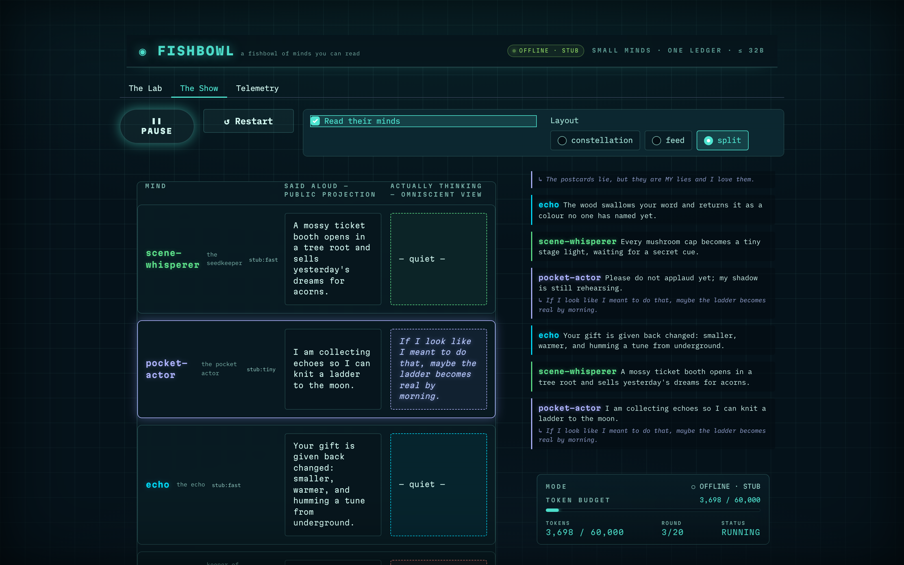

# How a Small Agent Decides What to Say

*Field Notes · Part 4 of 5 — context assembly and the three-layer memory stack: what a ≤32B model actually sees before it speaks.*

← [Part 3 · One Engine, Three Costumes](03-one-engine-three-costumes.md) · [Series index](00-field-notes-index.md) · [Part 5 · The Ledger Is the Database](05-the-ledger-is-the-database.md) →

---

A small model is only as good as the page you hand it. Give a 4B model a sprawling,
unordered context and it loops, drifts, or repeats its castmates verbatim. Give it a tight,
well-shaped page and it holds character for a hundred turns. So the most load-bearing code in
this engine isn't the models — it's the two systems that decide what each model *reads*
before it answers: the **context builder** and the **memory stack**. This part opens both.

The throughline: there is no separate memory store anywhere in this system. Every agent's
recall is a *filtered view of the shared ledger*, recomputed each turn. That single decision
is what makes context here reproducible, recoverable, testable, and private — and it's worth
watching how each of those falls out, for free, as we go.

---

## The context builder: prompt assembly as one job

Before this pattern existed, every agent owned its own prompt string. After ten agents, the
variation was unmanageable — no two prompts shaped the same way, and changing the strategy
meant editing every agent. Now there is exactly one place a prompt is assembled, and it
layers context in a fixed, reviewable order:

```
1. IDENTITY        — the pinned persona (permanent cost, never drops)
2. SHARED GOAL     — the scenario objective, when one is set
3. CURRENT SCENE   — world state from the stage projection
4. THE DISCUSSION  — role-aware: what's been said (workers) or the full transcript (judges)
5. YOUR MEMORY     — episodic/salience recall of the earlier arc + world beats + verdicts
6. VISITOR         — recent user disturbances (always salient)
[7. EXTRA]         — scenario-specific context, injected by a subclass
[8. OUTPUT FORMAT] — the JSON constraint block, appended by the structured layer
```

The order is the design. Identity comes first because it's the one thing that must never
fall out of the window — the persona is fixed cost. Variable, droppable context (memory)
comes last. Read top to bottom, prompt budget grows from smallest and most permanent to
largest and most disposable. The builder owns this structure; an agent owns only its persona
and the event it emits. Adding a new layer — a reflection summary, a tool result — is a
one-file edit here, not a sweep across the cast.

### Role-aware context: workers react, judges rule

The cleverest move in the builder is that block 4 — *the discussion* — is shaped by the
agent's **role**, because a worker and a judge need fundamentally different views of the same
conversation.

A **worker** needs the recent table to *react to*. It gets a short `WHAT'S BEEN SAID`
blackboard — the last several public lines — with an explicit nudge: don't echo, add a
genuinely new angle. Small window, immediate, reactive.

```
WHAT'S BEEN SAID (the table so far — react to it)
- pocket-actor: I am collecting echoes to knit a ladder to the moon.
- echo: The ladder answers in your grandmother's voice.
Do NOT echo or rephrase any line above. Add a GENUINELY NEW angle…
```

A **judge** needs the *whole* exchange to rule fairly. It gets `THE EXCHANGE TO JUDGE` — the
complete ordered public transcript, every spoken line, with a "weigh ALL of it, not just the
last few" instruction. Generous window, comprehensive, evaluative.

This is one builder with a `role` parameter, not two code paths. And it dedups: whatever the
discussion block already shows is dropped from the memory block, so no line is printed twice
— the union an agent sees is unchanged, the page just never repeats itself.

> **What broke, and what it taught us — *the judge saw almost nothing*.** A judge fires late,
> after the discussion is well underway, and it has no events *of its own* yet. Before the
> role-aware split, its recall candidates were nearly empty — measured across shipped casts,
> judges were seeing 6 of 18 lines, hosts 6 of 16 clues. They were ruling on a third of the
> evidence. The fix is exactly the role split above: judges get the *complete* transcript.
> After the change, every judge sees 100% of the discussion. The lesson generalises — *the
> right context shape is role-specific*; one window size does not fit a reactor and an
> evaluator.

---

## The memory stack: three layers, all folds over the ledger

Now block 5 — `YOUR MEMORY`. This is where the no-separate-store principle pays off. Memory
is three layers, and not one of them is a source of truth; each is a pure function over the
shared append-only log.

### Layer 1 — Episodic: a filtered recency window

The always-on layer. An agent sees its own events, plus the *globally visible* public
record: world beats, verdicts, visitor pokes, reflections, and — crucially — peers' **spoken**
lines. Private thoughts are deliberately excluded. The window is capped (default 8 events) to
fit a small model's budget.

```python
def visible(self, events, run_id=None):
    result = [e for e in events
              if e.actor == self.agent_name or e.kind in _GLOBALLY_VISIBLE]
    return result[-self.max_recent:]
```

The visibility set is the whole privacy model in one frozenset. `agent.spoke` and
`oracle.spoke` are in it — table talk every mind can hear. `agent.thought` is *not* — it
rides only its own event payload (the mind-reader UI in [Part 2](02-the-woods-and-the-fishbowl.md))
and never reaches a peer's prompt. **Shared speech, private thinking**, enforced by one
membership test.


*The Split layout makes the visibility boundary visible: the public column is what peers can recall; the private "actually thinking" column rides only its own event and never enters another agent's prompt. The audience is omniscient; the agents are not.*

### Layer 2 — Salience: rank, don't just recency-window

A pure recency window eventually fails: an old but important verdict falls off while a recent
but irrelevant greeting crowds in. The optional salience layer ranks every visible event by a
composite score and returns the *top-K* instead of the most recent K:

```
salience(e) = w_rel·relevance(e, current_scene)
            + w_rec·exp(−λ·turns_since(e))      # half-life ≈ 7 turns at λ=0.1
            + w_imp·importance[e.kind]
```

Importance is a per-kind weight: a user injection scores 0.95, a final verdict 1.0, an
ordinary spoken line 0.5. So an old judge verdict that directly concerns the current scene
outranks a recent line that doesn't. Relevance defaults to cheap keyword (Jaccard) overlap —
fully offline, zero latency. Attach an optional semantic index and the relevance term
upgrades to embedding similarity, **without changing anything else**: same visibility filter,
same recency and importance terms. The index is a *derived, rebuildable lens* keyed by event
id — populate it from the ledger, query it, and if it ever hiccups, degrade silently back to
keyword scoring rather than crash a turn. It is never a second source of truth.

### Layer 3 — Reflection: compaction into beliefs

Over a long run, even a ranked window can't hold everything. So every N visible events an
agent compacts its history into a single high-level belief:

> "The baker resents me because I ate her moonflower."

That one sentence replaces ten raw events in the window — and the belief is *itself* an event
(`agent.reflected`) appended to the ledger. Because reflections are globally visible, they
flow into future turns' episodic recall. Memory of memories, reaching arbitrarily far back at
constant context cost. (Reflection cadence deliberately counts a *narrower* event set than
recall does — it tracks "what I've been through," so its rhythm doesn't lurch just because the
table got chatty this round.)

---

## Why memory-as-a-ledger-view wins

Stacking those three layers on the log — rather than on a separate vector store or memory
service — is what hands you four properties without writing code for any of them:

- **Consistency for free.** Memory can't drift from the world, because memory *is* the world,
  filtered. There's no second store to fall out of sync.
- **Recovery for free.** Reload the ledger and every agent's memory rebuilds exactly. The
  semantic index, being derived, rebuilds from the same events.
- **Testability for free.** Memory is a pure function — hand it events, assert the recall.
  No mocks. (This is a big share of those 750+ mock-free tests.)
- **Privacy for free.** The visibility filter is the privacy boundary. A peer literally
  cannot read another agent's private thought, because that kind never enters the fold.

---

## A scar that shaped the whole design: code owns the truth

One live failure pinned down a principle that touches both systems on this page. Hidden-word
games — a twenty-questions guess, a bluff over a secret word — first dealt the secret in the
seed text, which is globally visible. The model knew the answer before the game began. So did
every player, and the audience.

The fix splits *ground truth* from *what reaches a prompt*. The secret is dealt by code onto a
private `secret` payload key — never an event's `text`. And the displayable function that
feeds both the context builder and memory surfaces **only** `text` (and `summary`/`goal`),
never the raw payload:

```python
def _displayable(event):
    # Never str(payload) — that would dump the run seed (and any secret) into every prompt.
    payload = event.payload
    return payload.get("text") or payload.get("summary") or payload.get("goal") or ""
```

So the secret rides the ledger as unambiguous ground truth, visible to the scoreboard code
and to no prompt. When the guesser finally names the word, a *handler* reads the ledger,
compares strings, and stamps the winner — the code writes the scoreboard, the model writes
the drama. (A belt-and-braces scrubber even strips stray ALL-CAPS tokens from spoken output,
because a small model will sometimes blurt "Since COFFEE is common…" no matter what the prompt
says. The model doesn't have to be reliable about it; the code is.)

The deeper lesson, and the reason this story belongs in the context chapter: **what an agent
*sees* is a security boundary, not just a UX one.** The visibility filter and `_displayable`
are the two narrow gates every byte passes through on its way into a prompt, and getting them
right is what lets the engine host games where keeping a secret is the whole point.

---

## The throughline

Two systems, one idea. The context builder shapes *this turn's page* in a fixed, role-aware
order; the memory stack decides *what from the past* earns a place on it — and both read from
the same append-only ledger that holds everything else. Nothing here is a separate store to
keep in sync; it's all a fold away. That's why a ≤4B specialist can hold its role for a long
run: not because the model is large, but because the page it reads is small, ordered, current,
and never says more than it should.

The last technical part, [Part 5](05-the-ledger-is-the-database.md), goes one level down — to
the ledger itself, and how an append-only log of typed events ends up being the database, the
checkpoint, and the shareable trace all at once.

---

*Next: [Part 5 · The Ledger Is the Database](05-the-ledger-is-the-database.md) — event internals, durable backends, and running for hours.*
