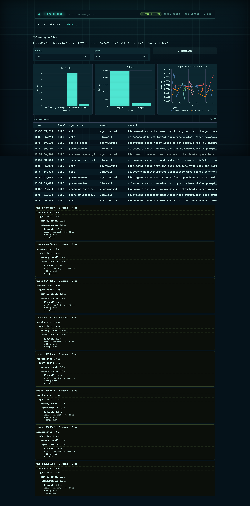

# The Ledger Is the Database

*Field Notes · Part 5 of 5 — what an append-only log of typed events buys you: the store, the checkpoint, the trace, and a 24-hour run that doesn't break the bank.*

← [Part 4 · How a Small Agent Decides What to Say](04-how-a-small-agent-decides.md) · [Series index](00-field-notes-index.md) · [Part 0 · Field Notes index](00-field-notes-index.md) →

---

Every other part of this series leans on one sentence: *the append-only ledger is the single
source of truth.* This is the part that earns it. We'll open the event envelope, look at how
it's stored, how the same contract drives a local SQLite file and a hosted Postgres, and how
that one design buys crash recovery, reproducibility, a shareable trace, and the ability to
run for hours without a surprise bill — all without a separate database layer, a checkpoint
mechanism, or an agent framework.

---

## An event is a flat, immutable record

There is exactly one kind of write in this system: append an `Event`. The whole schema:

```python
class Event(BaseModel):
    model_config = ConfigDict(extra="forbid")

    id: str                      # UUID, the idempotency key
    run_id: str                  # which run this belongs to
    turn: int                    # sim-clock turn
    kind: str                    # open, dot-namespaced — "agent.spoke", "clue.found"
    actor: str                   # who emitted it
    payload: dict[str, Any]      # the content; shape is per-kind convention
    created_at: datetime
    schema_version: int = 1
    session_id: str | None       # which browser/user drove the run
    model_profile: str | None    # the route key the agent asked for
    model_id: str | None         # the concrete model that actually ran
```

Two design choices in here do a lot of work.

**The `kind` is an open, format-validated string — not an enum.** It must be a lowercase,
dot-namespaced identifier (`agent.spoke`, `clue.found`, `episode.published`), and a regex
validator rejects anything malformed. But the *set* of kinds is open: a new scenario invents
`oracle.spoke` or `commentary.note` without touching the core. The schema validates the
*shape* of a kind; per-agent `manifest.may_emit` governs the *authority* to emit one. This is
the modularity contract from [Part 3](03-one-engine-three-costumes.md) made concrete — it's
why the engine holds still while eight scenarios move.

**The envelope grows by addition, never migration.** `session_id`, `model_profile`, and
`model_id` were all added after launch as nullable fields. Old rows load with `None`;
`schema_version` stays `1` because nothing existing changed shape. An append-only log you
can only *extend* pairs naturally with a schema you can only *extend* — new keys alongside
old ones, no rewrite of history.

---

## Idempotency: why the UUID, not a sequence

Small models running for hours means retries — a flaky endpoint, a timed-out call, a
re-driven conductor step. The danger of retries against an append-only log is the
double-write: the same turn committed twice.

The defence is the `id`. Every event carries a UUID minted at creation, and append is
idempotent against it:

```python
def append(self, event: Event) -> Event:
    if event.id in self._seen_ids:   # already have it — no-op
        return event
    self._events.append(event)
    self._seen_ids.add(event.id)
    return event
```

Retry a step that already committed and the second append is a silent no-op, because it
carries the *same* id. This is why ordering uses a separate, server-assigned `offset` (more
below) rather than the `id` — the id's job is identity, not order. It's also why a
crash mid-turn is safe: events written before the crash are recovered; events computed but
not yet written are simply recomputed on the next run and de-duplicated if they collide.

---

## One contract, two backends

The `Ledger` is an interface, not a class you're stuck with. The in-memory version above is
the offline default — a list and a set. The durable version, `SqlAlchemyLedger`, implements
the *same* contract through SQLAlchemy 2.x, which means the identical code drives a local
SQLite file and a hosted Postgres. The table:

```python
Table("events", metadata,
    Column("offset", Integer, primary_key=True, autoincrement=True),  # global order
    Column("id", String(64), unique=True, nullable=False),            # idempotency
    Column("run_id", String, index=True),
    Column("turn", Integer),
    Column("kind", String, index=True),
    Column("actor", String, index=True),
    Column("payload", Text),            # JSON
    Column("created_at", DateTime(timezone=True)),
    Column("schema_version", Integer, server_default="1"),
    Column("session_id", String, index=True),
    Column("model_profile", String),
    Column("model_id", String, index=True),
    Index("ix_events_run_offset", "run_id", "offset"),  # the hottest read
)
```

The decisions here mirror the in-memory store so it's a true drop-in:

- **`UNIQUE(id)` enforces idempotency at the database layer.** A duplicate insert raises
  `IntegrityError`, which append catches and ignores. Two workers racing the same retry can't
  double-write, even across processes.
- **A serial `offset` gives deterministic order** — independent of clock skew in
  `created_at` or duplicate `turn` values on retry. You never trust the wall clock for
  ordering; you trust the insertion sequence the database assigns.
- **The payload is JSON in a `Text` column**, not an opaque blob. The trace stays
  human-readable and greppable.
- **An in-memory cache mirrors the rows** so hot reads (`events`) don't round-trip the
  database; the DB is consulted for replay (`tail`) and on open (`from_file`).

Backend selection lives in one tiny factory. A `DATABASE_URL` is **required** — the app
refuses to run without a real event store rather than silently degrading to an ephemeral one:

```python
def make_ledger(url=None):
    resolved = url or os.getenv("DATABASE_URL")
    if not resolved:
        raise RuntimeError("DATABASE_URL is required — the event store is not optional.")
    return SqlAlchemyLedger(_normalize_db_url(resolved))
```

Tests pass `sqlite://` for an ephemeral in-process store; production points at a Neon
Postgres URL. (The factory even rewrites a bare `postgresql://` to name the psycopg3 driver
this project ships, so a copy-pasted Neon URL just works.) The agents, scenarios, and
projections never learn which backend they're on.

> **A decision worth naming: why not the `eventsourcing` library?** It models DDD aggregates
> with per-entity version streams. This engine wants the opposite — one *flat, globally
> ordered* log, not many per-entity streams. Raw SQLAlchemy over a single `events` table
> matches the grain of the system; the framework would have fought it.

---

## Crash recovery: the ledger is the checkpoint

Because every view is a pure projection of the log, recovery isn't a feature you build — it's
the absence of one. There is no separate checkpoint to restore, fall out of sync, or corrupt.

```python
# After a crash:
ledger = SqlAlchemyLedger.from_file("runs/events.db")  # rehydrate from disk
conductor = Conductor(scenario, ledger=ledger)
conductor.restore()   # set the turn counter from the ledger's tail
conductor.step()      # continue from exactly where it stopped
```

`from_file` reloads the rows and rebuilds the in-memory cache; `restore()` reads the turn
counter back from the log. Every event committed before the crash is present; everything
downstream is a fold away. For very long runs, `snapshot_to(dest)` copies the log into a
fresh ledger at a destination — and because there's no portable vendor backup API across
Postgres and SQLite, the snapshot is *itself* a replay into a new store. A Postgres run can
checkpoint to a portable local SQLite file that `from_file` reopens anywhere. Replay is fast:
sequential reads, then a pure in-memory fold over events.

---

## The economic story: per-agent model routing

Running for hours is a cost problem before it's anything else, and the answer is the same
small-models-as-specialists idea from Part 1, expressed in code. Each agent declares a
logical *profile*; a `ModelRouter` binds that profile to a concrete model and decoding config:

```python
_PROFILE_DECODING = {
    "tiny":     {"temperature": 0.7, "max_tokens": 192},   # ≤4B
    "fast":     {"temperature": 0.9, "max_tokens": 320},   # ≤7B
    "balanced": {"temperature": 0.8, "max_tokens": 768},   # reasoning tier
    "strong":   {"temperature": 0.6, "max_tokens": 1024},  # ≤32B
}
```

The router is the *single* place a model is named, which buys three things: swapping a
profile to a different small model is a one-line change; a scenario can mix a `tiny` worker
with a `strong` judge for free; and the rest of the engine never names a model. An agent
manifest can also pin a *specific* catalogue model with `model_endpoint`, bypassing the tier
— which is how one cast legitimately runs several different sponsor models in the same show.

Behind the profile sits a multi-backend registry: an OpenAI-compatible HTTP gateway to
small models served on cloud GPUs (the main path), a serverless inference backend, and an
in-process `transformers` backend for GPU-grant environments. The router dispatches on the
resolved backend; the agent is oblivious. Offline, every profile resolves to a
`DeterministicTinyModel` stub — fixed structured outputs, zero inference — so the whole show
runs on stage with no credentials, no network, no GPU. That stub is the spine of the 750+
mock-free tests and the reproducible demo.

> **The decoding numbers carry a scar.** The `balanced`/`strong` tiers are reasoning models:
> they *think* before answering, and the thinking counts against `max_tokens`. An early run
> capped `balanced` at 320 tokens, the models truncated mid-thought, and three of four
> players in a scenario went silent before it began. The fix was to give the reasoning tiers
> real room — which is why `balanced` is 768 and `strong` 1024 above. Small models need the
> right *shape* of budget, not just a budget.

---

## The governor: cost before it bites you

The router decides *what* runs; the governor decides *how much*. It's the runtime circuit
breaker, checked before every scheduled agent:

```python
Governor(
    max_turns=100,            # the show ends after N turns
    max_calls_per_turn=8,     # no single turn fires more than N model calls
    max_total_calls=500,      # whole-run call cap
    max_total_tokens=None,    # optional token ceiling
    hourly_budget_usd=None,   # optional spend ceiling
)
```

When a bound trips it raises a named `BudgetExceeded(reason=...)` that the UI surfaces as a
graceful end-of-show, recorded in the ledger as a `run.finished` with the reason. The other
half of cost control is structural: agents that aren't scheduled cost *nothing*. Twenty
villagers in the registry, three acting this turn — the other seventeen are free, just
manifest rows whose memory already lives in the ledger. There's no idle agent to pay for,
because an idle agent is just data.

---

## Two clocks make hours tractable

Long runs need to separate *how fast the world thinks* from *how fast the wall ticks*.

- **Sim-time** advances once per conductor step. It can run faster than real time (batch
  mode) or slower (rate-limited for budget).
- **Wall-clock** drives production cadence. "One episode per hour" is a cron trigger every
  60 minutes that runs a batch of sim-ticks and then publishes the artifact.

```
Wall clock                          Sim clock
   │   cron: 0 * * * *                  │
   └─────────┼──→ conductor.step(×N) ───┘
                       │
                   N sim-ticks at inference speed (faster than real time in batch mode)
```

The same engine therefore serves a demo running a few turns per second under manual control,
a village simulating a full day in minutes, and a serial that publishes on a real-hour
cadence for weeks. The ledger does all the bookkeeping; nothing special is layered on top.

---

## The trace is the product

Here's the payoff that ties the whole series together. Because the ledger records everything
as typed events, **the trace is not an export you build — it's the data structure you already
have.** Every run is framed by a `run.started` (scenario name, the full cast→model binding
map, the seed) and a `run.finished` (winner, winning model, reason, turns, tokens). Slice
those events for a run, write them as JSONL, and you have a self-describing agent trace ready
to publish — no extra bookkeeping, because the ledger was always keeping the record.


*The Telemetry tab is just another reader over the same log: the structured feed, the per-agent token and latency charts, and the per-trace timelines are all projections of the append-only ledger — the observability surface and the shareable trace are the same data.*

That's the quiet thesis of Multi-Agent Land. One append-only log of typed events is
simultaneously the database, the checkpoint, every agent's memory, the UI's render source,
and the shareable trace. You don't build those five things. You build the log, and project
the rest.

---

*This is the last technical part. For the map of the whole series, head back to
[Part 0 · the Field Notes index](00-field-notes-index.md).*
